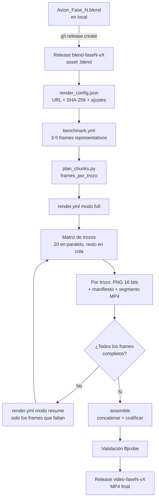

# Proyecto AX620 · Render distribuido en GitHub Actions

Modelo de un **avión comercial (AX620)** construido en **Blender 5.2** por fases, 100 % procedural.
Este repositorio no guarda el modelo: guarda la **maquinaria para renderizar sus vídeos y fotos
de presentación** con Cycles en los runners gratuitos de GitHub Actions.

Primer objetivo: **«Vídeo Fase 3»** a partir de `Avion_Fase_3_Cabina.blend` (~70 MB).

> **Estado:** estrategia documentada y plantilla de configuración lista. Los workflows y scripts
> se implementarán siguiendo [`docs/ESTRATEGIA_RENDER.md`](docs/ESTRATEGIA_RENDER.md).

## ¿Por qué GitHub Actions?

- No hay GPU disponible y un portátil o un entorno de 2 núcleos tardaría semanas.
- En un **repositorio público**, los runners estándar de Linux (4 vCPU, 16 GB de RAM, 14 GB de
  disco) son **gratuitos y sin cuota de minutos**.
- Cada trabajo puede durar hasta **6 h** y la cuenta puede tener **20 trabajos a la vez**; el
  resto espera en cola sin intervención. Partiendo el vídeo en trozos de ~4 h 30 min, cientos de
  horas de CPU se convierten en unas pocas horas de tiempo real.

Ejemplo (cifras supuestas): con 300 s por frame, un vídeo de 90 s a 30 fps (2.700 frames) se
divide en 59 trozos de hasta 46 frames que se renderizan en 3 oleadas de 20: **~15 h** en lugar
de 225 h.

## Cómo funciona



## Guía rápida: cómo renderizar un vídeo nuevo

Requisitos: [GitHub CLI](https://cli.github.com/) (`gh`) autenticado con acceso a este
repositorio, y Blender 5.2 en local para preparar el `.blend`.

1. **Preparar el `.blend`**: *File → External Data → Pack Resources*, guardar y calcular el hash:
   ```bash
   sha256sum Avion_Fase_3_Cabina.blend
   ```
2. **Publicarlo como asset de una Release** (nunca en Git ni en LFS):
   ```bash
   gh release create blend-fase3-v1 Avion_Fase_3_Cabina.blend \
     --title "Blend Fase 3 v1" --notes "SHA-256: <hash>"
   ```
3. **Configurar**: copiar `render_config.example.json` a `render_config.json` y rellenar URL y
   SHA-256 del `.blend`, escena, cámara, rango de frames, resolución, fps, muestras y nombre del
   vídeo. Commit y push.
4. **Benchmark** con el frame más simple, el más pesado y uno intermedio:
   ```bash
   gh workflow run benchmark.yml -f frames=1,1350,2700
   gh run watch
   ```
5. **Planificar**: anotar en `render_config.json` el `s_por_frame_max` medido y
   `frames_por_trozo = floor(16200 / (s_por_frame_max × 1.15))`. Repasar la
   [checklist](docs/ESTRATEGIA_RENDER.md#n-checklist-previa-al-lanzamiento). Commit y push.
6. **Lanzar y vigilar**:
   ```bash
   gh workflow run render.yml -f modo=full
   gh run list --workflow render.yml
   gh run watch <run_id>
   ```
7. **Si algún trozo no terminó**: *Re-run failed jobs* en la página de la ejecución, o
   ```bash
   gh workflow run render.yml -f modo=resume -f runs_previos=<run_id>
   ```
8. **Resultado**: al completarse todos los frames, el trabajo `assemble` monta, valida y publica
   el MP4 en la Release `video-fase3-v1`.

## Documentación

| Documento | Para qué |
|---|---|
| [`docs/ESTRATEGIA_RENDER.md`](docs/ESTRATEGIA_RENDER.md) | Especificación completa: límites de GitHub verificados, arquitectura, fórmulas, reanudación, montaje, fallos y checklist. |
| [`render_config.example.json`](render_config.example.json) | Plantilla de configuración comentada. |
| [`CLAUDE.md`](CLAUDE.md) | Reglas obligatorias para agentes (Claude Code) que trabajen en el repositorio. |

## Aviso

Todo lo que se publica aquí (código, `.blend`, frames, vídeos y logs) es **público**. Este
repositorio usa GitHub Actions solo para renderizar los vídeos de este proyecto, de forma
puntual y siguiendo las normas de uso de GitHub.
