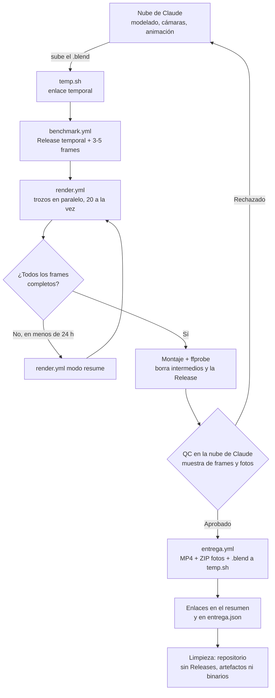

# Proyecto AX620 · Render distribuido en GitHub Actions

Modelo de un **avión comercial (AX620)** construido en **Blender 5.2** por fases, 100 % procedural.

Este repositorio **no guarda el modelo ni los resultados**: guarda la maquinaria para
renderizar sus vídeos y fotos de presentación con Cycles en los runners gratuitos de
GitHub Actions y entregarlos mediante enlaces de descarga temporales.

Primer objetivo: **«Vídeo Fase 3»** a partir de `Avion_Fase_3_Cabina.blend` (~70 MB).

> **Estado:** estrategia documentada y plantilla de configuración lista. Los workflows y scripts
> se implementarán siguiendo [`docs/ESTRATEGIA_RENDER.md`](docs/ESTRATEGIA_RENDER.md).

## Quién hace qué

| | Se encarga de |
|---|---|
| **Nube de Claude** | Inspección, modelado, cámaras, animación, configuración, lanzamiento y vigilancia de los renders, **control de calidad** y entrega de los enlaces. |
| **GitHub Actions** | Solo potencia de cálculo: renderizar vídeo y fotos, montar, subir la entrega y limpiar. |
| **temp.sh** (alternativa: Litterbox) | Alojar la entrega durante **3 días**: MP4 final, ZIP de fotos y `.blend` final. |

## ¿Por qué GitHub Actions?

- No hay GPU disponible y la nube de Claude (2 núcleos) tardaría semanas en un render final.
- En un **repositorio público**, los runners estándar de Linux (4 vCPU, 16 GB de RAM, 14 GB de
  disco) son **gratuitos y sin cuota de minutos**.
- Cada trabajo puede durar hasta **6 h** y la cuenta puede tener **20 trabajos a la vez**; el
  resto espera en cola sin intervención.

Ejemplo (cifras supuestas): con 300 s por frame, un vídeo de 90 s a 30 fps (2.700 frames) se
divide en 59 trozos de hasta 46 frames que se renderizan en 3 oleadas de 20: **~15 h** en lugar
de 225 h.

## Cómo funciona



## Guía rápida: cómo renderizar un vídeo nuevo

Normalmente todo lo hace una sesión de Claude Code en la nube con las herramientas de GitHub;
los comandos `gh` equivalentes sirven para hacerlo a mano.

1. **Preparar el `.blend`** (nube de Claude): *File → External Data → Pack Resources*, guardar,
   `sha256sum Avion_Fase_3_Cabina.blend` y subirlo:
   ```bash
   curl -F "file=@Avion_Fase_3_Cabina.blend" https://temp.sh/upload
   ```
   ⚠️ A partir de aquí el `.blend` es público hasta que termine el proceso.
2. **Configurar**: copiar `render_config.example.json` a `render_config.json` y rellenar el
   enlace y el SHA-256 del `.blend`, escena, cámara, frames, resolución, fps, muestras y fotos.
   Commit y push.
3. **Benchmark** (crea también la Release temporal de transporte):
   ```bash
   gh workflow run benchmark.yml -f frames=1,1350,2700
   ```
4. **Planificar**: anotar `s_por_frame_max` y
   `frames_por_trozo = floor(16200 / (s_por_frame_max × 1.15))`. Repasar la
   [checklist](docs/ESTRATEGIA_RENDER.md#q-checklist-previa-al-lanzamiento). Commit y push.
5. **Lanzar y vigilar**:
   ```bash
   gh workflow run render.yml -f modo=full
   gh run watch <run_id>
   ```
6. **Si algún trozo no terminó** (en menos de 24 h): *Re-run failed jobs*, o
   ```bash
   gh workflow run render.yml -f modo=resume -f runs_previos=<run_id>
   ```
7. **Control de calidad**: la nube de Claude descarga el artefacto `muestra-qc`, revisa frames y
   fotos y emite el veredicto.
8. **Entrega** (solo con el QC aprobado):
   ```bash
   gh workflow run entrega.yml -f run_montaje=<run_id> -f qc_aprobado=true -f qc_resumen="…"
   ```
   Los enlaces aparecen en el resumen de la ejecución y en `entrega.json`. **Caducan a los 3 días.**
   Para descargar por terminal desde temp.sh: `curl -X POST -o archivo <enlace>`.
9. **Limpieza**: automática al final de la entrega. El repositorio queda sin Releases, sin
   artefactos y sin binarios.

## Documentación

| Documento | Para qué |
|---|---|
| [`docs/ESTRATEGIA_RENDER.md`](docs/ESTRATEGIA_RENDER.md) | Especificación completa: roles, límites verificados, arquitectura, fórmulas, reanudación, montaje, QC, entrega, limpieza, fallos y checklist. |
| [`render_config.example.json`](render_config.example.json) | Plantilla de configuración comentada. |
| [`CLAUDE.md`](CLAUDE.md) | Reglas obligatorias para agentes (Claude Code) que trabajen en el repositorio. |

## Aviso

El repositorio es **público**: el código, los logs, la Release temporal con el `.blend` y los
enlaces de entrega son visibles mientras existen. No se guardan credenciales en el repositorio;
si algún servicio las necesitara, irían en GitHub Secrets. GitHub Actions se usa solo para
renderizar los vídeos de este proyecto, de forma puntual y siguiendo las normas de uso de GitHub.
