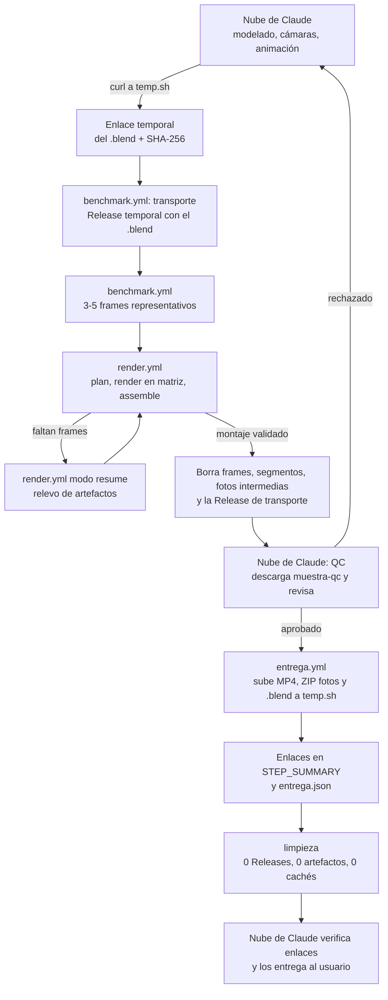
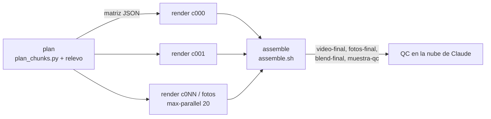
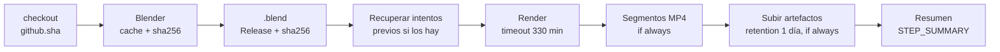

# Estrategia de render distribuido en GitHub Actions

Documento maestro del proyecto AX620. Es la **especificación** que deben seguir
`.github/workflows/benchmark.yml`, `.github/workflows/render.yml`, `.github/workflows/entrega.yml`,
`scripts/render_chunk.py`, `scripts/plan_chunks.py`, `scripts/assemble.sh`, `scripts/entrega.sh`,
`scripts/limpieza.sh`, `scripts/qc_muestra.py` y `render_config.json`.
Si la implementación y este documento discrepan, se corrige uno de los dos en el mismo commit.

- **Fecha de verificación de límites (GitHub y servicios de descarga):** 2026-10-02.
- **Versión de Blender verificada:** 5.2.2 (tarball Linux x64 publicado el 15-09-2026 en download.blender.org).
- **Convención numérica:** en el texto, separador de miles con punto y decimales con coma (16.200 s; 1,15). En código y JSON, notación inglesa (`16200`, `1.15`).

## Índice

- [0) Reparto de roles y ciclo de vida](#0-reparto-de-roles-y-ciclo-de-vida)
- [a) Recursos y límites](#a-recursos-y-límites)
- [b) Arquitectura](#b-arquitectura)
- [c) Transporte temporal del .blend](#c-transporte-temporal-del-blend)
- [d) Instalación y ejecución de Blender en el runner](#d-instalación-y-ejecución-de-blender-en-el-runner)
- [e) Benchmark obligatorio](#e-benchmark-obligatorio)
- [f) Cálculo de trozos y partes](#f-cálculo-de-trozos-y-partes)
- [g) Ajustes de render comunes](#g-ajustes-de-render-comunes)
- [h) Seguridad ante el corte de 6 h y artefactos](#h-seguridad-ante-el-corte-de-6-h-y-artefactos)
- [i) Reanudación y relevo](#i-reanudación-y-relevo)
- [j) Montaje final](#j-montaje-final)
- [k) Fotos fijas](#k-fotos-fijas)
- [l) Control de calidad en la nube de Claude](#l-control-de-calidad-en-la-nube-de-claude)
- [m) Entrega por servicio de descarga externo](#m-entrega-por-servicio-de-descarga-externo)
- [n) Limpieza final](#n-limpieza-final)
- [o) Vigilancia y fallos](#o-vigilancia-y-fallos)
- [p) Riesgos y normas](#p-riesgos-y-normas)
- [q) Checklist previa al lanzamiento](#q-checklist-previa-al-lanzamiento)
- [Referencia de render_config.json](#referencia-de-render_configjson)
- [Contratos entre componentes](#contratos-entre-componentes)
- [r) Notas de implementación](#r-notas-de-implementación)

---

## 0) Reparto de roles y ciclo de vida

| Quién | Hace | No hace |
|---|---|---|
| **Nube de Claude** (sesiones de Claude Code en la nube; 2 núcleos, sin GPU) | **Todo el trabajo creativo y de control:** inspección del `.blend`, modelado, cámaras, animación, previsualizaciones rápidas (Eevee o pocas muestras), preparación de `render_config.json`, lanzamiento y vigilancia de workflows (herramientas MCP de GitHub), **control de calidad** de la muestra y entrega de los enlaces al usuario. | Renders finales de vídeo o fotos (demasiado lentos aquí). |
| **GitHub Actions** (runners estándar, repo público) | **Exclusivamente potencia de cálculo:** renderizar frames y fotos, codificar, montar, subir la entrega al servicio externo y limpiar. | Decidir nada creativo, modificar el `.blend` ni guardar resultados. |
| **Repositorio** | Código, workflows, documentación y `render_config.json`. | **No almacena resultados**: ni `.blend`, ni frames, ni vídeos, ni fotos. Releases y artefactos son solo transporte temporal y se borran. |
| **Servicio de descarga externo** (temp.sh; alternativa Litterbox) | Alojar durante 3 días el MP4 final, el ZIP de fotos, el `.blend` final y `entrega.json`, y también el `.blend` de entrada para el transporte. | Almacenamiento permanente. |

### Ciclo de vida de un vídeo



**Estado final obligatorio del repositorio:** sin Releases, sin tags, sin artefactos, sin
cachés y sin binarios en Git. Solo quedan el código, la documentación y los logs de las
ejecuciones (texto, sin secretos).

---

## a) Recursos y límites

Todos los valores se han comprobado en la documentación oficial el **2026-10-02**.
⚠️ marca un valor que **ha cambiado** respecto a los datos de partida del proyecto.

### GitHub

| Límite | Valor | Consecuencia práctica | Verificado |
|---|---|---|---|
| Coste de Actions en repositorio público con runners estándar | **Gratis y sin cuota de minutos** ("free for standard GitHub-hosted runners in public repositories") | Podemos consumir cientos de horas de runner sin pagar. La cuota del plan Free (2.000 min/mes, 500 MB de artefactos) solo se aplica a repositorios privados. **El repositorio debe seguir siendo público.** | 2026-10-02 |
| Runner `ubuntu-latest` en repo público | **4 vCPU, 16 GB de RAM, 14 GB de SSD**, x64, Ubuntu 24.04, **sin GPU** | Cycles solo en CPU con 4 hilos. Disco ajustado: hay que presupuestar Blender + `.blend` + PNG + segmento. | 2026-10-02 |
| Runner `ubuntu-latest` en repo privado (referencia) | 2 vCPU, 8 GB de RAM, 14 GB de SSD | Si el repo pasara a privado tendríamos la mitad de CPU **y** consumiríamos minutos de pago. No hacerlo. | 2026-10-02 |
| Tiempo máximo por trabajo (job) | **6 h**; al llegar, el trabajo se termina y falla | Cada trozo se planifica a **4 h 30 min** de render útil y el paso de render se corta a **5 h 30 min** (`timeout-minutes: 330`). | 2026-10-02 |
| Duración máxima de una ejecución de workflow | **35 días** (incluye esperas en cola y aprobaciones) | No es el límite que nos condiciona: lo es la retención de 1 día de los artefactos (ver [f)](#f-cálculo-de-trozos-y-partes)). | 2026-10-02 |
| Trabajos por matriz | **256** por ejecución | Nunca se alcanza: cada parte tiene como máximo 60 trozos. | 2026-10-02 |
| Concurrencia (plan Free) | **20 trabajos simultáneos** (de ellos, máx. 5 de macOS), a nivel de **cuenta/plan**, no de repositorio | `max-parallel: 20`. El trabajo 21 en adelante espera en cola. Crear más repositorios **no** da más concurrencia. Cualquier otro workflow de la cuenta compite por esos 20 huecos. | 2026-10-02 |
| Re-ejecuciones | Máx. **50** re-ejecuciones por ejecución de workflow | "Re-run failed jobs" tiene tope. Si se agota, se usa el modo `resume` en una ejecución nueva. | 2026-10-02 |
| Retención de artefactos y logs | **90 días** por defecto; en repos públicos configurable entre **1 y 90 días** | Usamos **`retention-days: 1` en todos los artefactos** y además se borran explícitamente. Ventana de trabajo de 24 h desde cada subida. | 2026-10-02 |
| Almacenamiento de artefactos | Sin coste en repos públicos (la cuota de 500 MB del plan Free es para privados) | Aun así, retención de 1 día y borrado activo: el repo no guarda resultados. | 2026-10-02 |
| Caché (`actions/cache`) | **10 GB** por repositorio | Cacheamos el tarball de Blender (383.295.504 bytes ≈ 366 MiB para 5.2.2) durante el render; la limpieza final borra la caché. | 2026-10-02 |
| Tamaño de archivo en Git | Aviso a partir de **50 MiB**, bloqueo a partir de **100 MiB** (25 MiB vía navegador) | El `.blend` (~70 MB) no entra en Git. | 2026-10-02 |
| Git LFS, plan Free | ⚠️ **10 GiB de almacenamiento y 10 GiB/mes de ancho de banda** (antes ~1 GB + 1 GB/mes). Sin método de pago, al superarlo LFS se desactiva hasta el mes siguiente | **Sigue sin servir:** un vídeo de 59 trozos descarga 59 × 70 MB = 4.130 MB ≈ 3,85 GiB; con 2–3 vídeos al mes (más benchmarks y *resumes*) se agota la cuota y LFS queda bloqueado en todo el repositorio. Las Releases no tienen ese límite. | ⚠️ 2026-10-02 |
| Assets de Release | Cada archivo **< 2 GiB**; hasta **1.000** assets por Release; **sin límite** de tamaño total ni de ancho de banda | Transporte temporal del `.blend` hacia los runners (y nada más). | 2026-10-02 |
| `GITHUB_TOKEN` y `workflow_dispatch` | Los eventos creados con `GITHUB_TOKEN` no lanzan workflows, **salvo** `workflow_dispatch` y `repository_dispatch` | Una parte puede lanzar la siguiente con `gh workflow run` sin tokens personales (`permissions: actions: write`). | 2026-10-02 |
| Normas de uso de Actions | En runners de GitHub, prohibida "cualquier actividad no relacionada con la producción, prueba, despliegue o publicación del proyecto de software asociado al repositorio" y cualquier carga desproporcionada | Solo se renderiza **este** proyecto, de forma puntual. Ver [p)](#p-riesgos-y-normas). | 2026-10-02 |

Fuentes: GitHub Docs — *Actions limits*, *GitHub-hosted runners reference*, *GitHub Actions billing*,
*Removing workflow artifacts*, *Configuring the retention period…*, *About large files on GitHub*,
*Git LFS billing*, *About releases*, *Triggering a workflow*, *GitHub Terms for Additional Products and Features*.

### Servicios de descarga externos

Requisitos: sin cuenta, con API usable con `curl`, tamaño suficiente para un MP4 4K y
conservación de al menos unos días. Comprobados el **2026-10-02** en sus webs oficiales y con
una prueba real de subida y descarga (archivo de texto de prueba, SHA-256 idéntico a la vuelta)
desde la nube de Claude.

| Servicio | Papel | Tamaño máx. | Conservación | Cuenta | Subida | Descarga por script |
|---|---|---|---|---|---|---|
| **[temp.sh](https://temp.sh/)** | **Elegido** | **4 GB** por archivo | **3 días** (fijo) | No | `curl -F "file=@archivo" https://temp.sh/upload` → devuelve la URL | `curl -X POST -o archivo <url>` (con GET devuelve una página con botón de descarga, útil para humanos) |
| **[Litterbox](https://litterbox.catbox.moe/)** (catbox.moe) | Alternativa | **1 GB** por archivo | 1 h, 12 h, 24 h o **72 h** (usamos `72h`) | No | `curl -F reqtype=fileupload -F time=72h -F "fileToUpload=@archivo" https://litterbox.catbox.moe/resources/internals/api.php` | `curl -L -o archivo <url>` (enlace directo) |

Por qué **temp.sh**: es el único de los verificados que combina sin cuenta + API + **4 GB**
(margen para un MP4 2160p60) + 3 días de conservación, y funciona desde los runners y desde la
nube de Claude. Litterbox queda como alternativa porque da enlaces directos y es un servicio
veterano, pero su límite de **1 GB** puede no bastar a 4K.

Descartados el 2026-10-02: **0x0.st** (512 MiB y su portada rechaza explícitamente a clientes
automáticos), **Pixeldrain** (la API exige clave de cuenta), **Gofile** (sin documentación oficial
legible sin JavaScript; retención por inactividad no verificable).

Ambos servicios **guardan la IP de subida** y los enlaces son **públicos** para quien los tenga.
temp.sh es un proyecto personal sin acuerdo de servicio: por eso hay alternativa y verificación
de cada subida (ver [m)](#m-entrega-por-servicio-de-descarga-externo)).

---

## b) Arquitectura

**Un repositorio y tres workflows.** Nada de repositorios auxiliares ni cuentas adicionales.

| Workflow | Trabajos | Lo lanza |
|---|---|---|
| `.github/workflows/benchmark.yml` | `transporte` → `benchmark` (matriz, un frame por trabajo) → `resumen` | Nube de Claude (o el usuario) |
| `.github/workflows/render.yml` | `plan` → `render` (matriz de trozos y fotos) → `assemble` | Nube de Claude; las partes 2…P las lanza la parte anterior |
| `.github/workflows/entrega.yml` | `entrega` → `limpieza` | Nube de Claude **solo tras aprobar el QC** |



`render.yml`:

| Trabajo | Permisos | Qué hace |
|---|---|---|
| `plan` | `actions: read` | Lee `render_config.json`, calcula la huella de render, decide los trozos (`full`), los frames que faltan (`resume`) o los frames a rehacer (`parche`); hace el **relevo** de artefactos de ejecuciones previas ([i)](#i-reanudación-y-relevo)) y expone la matriz como salida JSON. |
| `render` | `actions: read` | `needs: plan`. `strategy.matrix.trozo: ${{ fromJSON(needs.plan.outputs.trozos) }}`, `fail-fast: false`, `max-parallel: 20`. Un trabajo por trozo de vídeo o por lote de fotos. |
| `assemble` | `actions: write`, `contents: write` | `needs: render`, `if: ${{ !cancelled() }}`. Comprueba cobertura, monta la parte, y en la última parte codifica el MP4 final, crea el ZIP de fotos, la muestra de QC, borra intermedios y borra la Release de transporte. Si faltan frames, falla con la lista exacta y el comando de `resume`. |

Esqueleto orientativo de la matriz:

```yaml
render:
  needs: plan
  runs-on: ubuntu-latest
  timeout-minutes: 360
  strategy:
    fail-fast: false        # un trozo fallido no cancela los demás
    max-parallel: 20        # = concurrencia del plan Free
    matrix:
      trozo: ${{ fromJSON(needs.plan.outputs.trozos) }}
  steps:
    # ... ver «Contratos entre componentes»
```

Cada elemento de la matriz es un objeto, para que `resume` pueda mandar rangos no contiguos y
para mezclar vídeo y fotos:

```json
{ "tipo": "video", "indice": 7, "nombre": "c007", "rangos": [[323, 368]] }
{ "tipo": "fotos", "indice": 0, "nombre": "l000", "fotos": ["cabina_frontal"] }
```

Puntos clave:

- **El límite de 6 h es por trabajo, no por cuenta ni por ejecución, y no se agota.** Cada trozo
  arranca con su propio reloj de 6 h. Si un vídeo necesita 300 h de CPU, se divide en
  ~67 trozos de 4,5 h (300 ÷ 4,5 = 66,7 → 67). GitHub ejecuta 20 a la vez y encola el resto.
  No hay que crear más repositorios ni hacer nada a mano.
- **La concurrencia es por cuenta.** `max-parallel: 20` llena todos los huecos del plan Free.
  Mientras se renderiza, cualquier otro workflow de la cuenta (también de otros repositorios)
  espera en cola. Un vídeo a la vez.
- **El trabajo 21 en adelante espera en cola automáticamente.** Hablamos de "oleadas" para
  estimar, pero en realidad la cola es continua.
- **Partes sucesivas.** Como todos los artefactos caducan a las 24 h, una ejecución de render
  no debe durar más de **18 h** de cota: como máximo **3 oleadas = 60 trozos** por ejecución
  (3 × ~6 h en el peor caso). Si el vídeo necesita más, `plan_chunks.py` lo divide en **partes**
  (rangos de frames consecutivos, de tamaño equilibrado) que se ejecutan una tras otra: al
  terminar la parte *k*, su trabajo `assemble` lanza la parte *k+1* con
  `gh workflow run render.yml -f modo=full -f parte=k+1 -f runs_previos=…` y el `plan` de la
  nueva parte hace el relevo de los artefactos anteriores.
- **Entradas de `render.yml` (`workflow_dispatch`):**

  | Entrada | Valores | Uso |
  |---|---|---|
  | `modo` | `full` · `resume` · `assemble` · `fotos` · `parche` | Tipo de ejecución. `fotos` solo si no hay vídeo; en `full` las fotos van en la última parte. |
  | `parte` | entero ≥ 1 (por defecto 1) | Parte del vídeo que se renderiza. |
  | `runs_previos` | IDs separados por comas | `resume`, `assemble`, `parche` y partes ≥ 2: ejecuciones cuyos artefactos se relevan. |
  | `frames_por_trozo` | entero (opcional) | Sobrescribe `troceo.frames_por_trozo` en esta ejecución (p. ej. −20 % en un `resume`). |
  | `rehacer_frames` | rangos, p. ej. `1201-1210,1500` | Solo `parche`: frames que se vuelven a renderizar tras un QC rechazado. |
  | `conservar_transporte` | `true` · `false` (por defecto `false`) | Si `true`, `assemble` no borra la Release de transporte (para depurar). |

- `concurrency: { group: render-${{ github.ref }}, cancel-in-progress: false }` a nivel de
  workflow: nunca dos ejecuciones de render a la vez. No usar `concurrency` a nivel de trabajo
  dentro de la matriz.
- La nube de Claude opera con las herramientas MCP de GitHub: `actions_run_trigger`
  (`run_workflow`, `rerun_failed_jobs`, `cancel_workflow_run`), `actions_list`
  (`list_workflow_runs`, `list_workflow_jobs`, `list_workflow_run_artifacts`) y `actions_get`
  (`get_workflow_run`, `download_workflow_run_artifact`, `get_workflow_run_logs_url`). Para
  renders largos programa revisiones periódicas en vez de esperar activamente.

---

## c) Transporte temporal del .blend

El `.blend` **nunca** entra en Git ni en LFS (ver tabla de límites). Viaja así:

```
Nube de Claude ──curl──▶ temp.sh (3 días) ──transporte──▶ Release temporal ──▶ cada runner
```

1. **En la nube de Claude:** *File → External Data → Pack Resources*, guardar y calcular
   `sha256sum Avion_Fase_3_Cabina.blend`.
2. **Subida a temp.sh** (alternativa: Litterbox con `time=72h`):
   `curl -fsS -F "file=@Avion_Fase_3_Cabina.blend" https://temp.sh/upload` → URL de origen.
3. Escribir en `render_config.json` → `blend.origen_url`, `blend.sha256`, `blend.release_tag`
   (`transporte-<fase>-v<n>`) y `blend.url`
   (`https://github.com/<propietario>/<repo>/releases/download/<tag>/<archivo>`). Commit y push.
4. **Trabajo `transporte`** (primer trabajo de `benchmark.yml`, `permissions: contents: write`):
   si la Release `blend.release_tag` no existe, descarga `blend.origen_url`
   (`curl -X POST` en temp.sh, `curl -L` en Litterbox), verifica el SHA-256 y crea la Release
   como *pre-release* con el `.blend` como único asset y la nota
   «Transporte temporal: se borra al terminar el render». Si existe, comprueba que el hash del
   asset coincide. `benchmark.yml` admite `solo_transporte=true` para volver a crear la Release
   sin repetir el benchmark (p. ej. para un `parche`).
5. **En cada runner:** descarga desde la Release (sin límite de ancho de banda) y verificación:

   ```bash
   curl -fL --retry 5 --retry-delay 10 -o "$RUNNER_TEMP/escena.blend" "$BLEND_URL"
   echo "$BLEND_SHA256  $RUNNER_TEMP/escena.blend" | sha256sum -c -   # aborta si no coincide
   ```

6. **Borrado:** al terminar el render (montaje validado en la última parte), `assemble` guarda
   una copia en el artefacto `blend-final` (para la entrega) y ejecuta
   `gh release delete <tag> --cleanup-tag --yes`. `limpieza` comprueba después que no queda
   ninguna Release ni tag.

Reglas:

- ⚠️ **Mientras la Release existe, el `.blend` es público** y cualquiera puede descargarlo. Lo
  mismo vale para el enlace de temp.sh durante sus 3 días. Antes de subirlo, revisar que no
  contiene nada que no deba verse.
- **Inmutabilidad durante un vídeo:** el asset no se reemplaza. Cualquier cambio en el `.blend`
  = hash nuevo + Release nueva (`transporte-fase3-v2`) + **vídeo nuevo desde cero** (cambia la
  huella de render).
- El SHA-256 garantiza que todos los runners renderizan exactamente el mismo archivo.

---

## d) Instalación y ejecución de Blender en el runner

**Versión exacta** fijada en `render_config.json` → `blender.version`, `blender.url`,
`blender.sha256` (tarball oficial de Linux x64 de download.blender.org con el SHA-256 de su
archivo `blender-<versión>.sha256`). Para 5.2.2:

- URL: `https://download.blender.org/release/Blender5.2/blender-5.2.2-linux-x64.tar.xz`
- Tamaño: 383.295.504 bytes
- SHA-256: `84098912789dc450e95697c4184fb8a90acbe5111c2ba4aede3fecb57806a168`

Pasos en el runner:

1. `actions/cache` sobre el tarball, con clave `blender-${version}-${sha256}`. En un fallo de
   caché: `curl -fL --retry 5` desde download.blender.org. En ambos casos, `sha256sum -c`.
2. Extraer a `$RUNNER_TEMP/blender` y **borrar el tarball** después (ahorra ~366 MiB de disco).
3. Dependencias del sistema que Blender headless puede necesitar en Ubuntu 24.04 (instalar con
   `sudo apt-get install -y --no-install-recommends` si faltan; confirmar la lista en el primer
   benchmark): `libxi6 libxxf86vm1 libxfixes3 libxrender1 libxkbcommon0 libsm6 libgl1 libegl1`.
4. `ffmpeg` para los segmentos: comprobar con `ffmpeg -version` e instalar con `apt-get` si no
   está presente.
5. Registrar en el log `blender --version`, `nproc`, `free -g`, `df -h` y el modelo de CPU
   (`lscpu`): sirven para explicar diferencias de tiempo entre runners.

Ejecución **headless** (siempre esta forma):

```bash
"$RUNNER_TEMP/blender/blender" -b "$RUNNER_TEMP/escena.blend" \
  --factory-startup -noaudio -t 4 \
  -P scripts/render_chunk.py -- \
  --config render_config.json \
  --trozo c007 --rangos 323-368 \
  --salida "$RUNNER_TEMP/frames" \
  --manifiesto "$RUNNER_TEMP/manifest-c007.json"
```

- `-b` (background) va primero con el `.blend`; `-P` ejecuta el script; todo lo que va después
  de `--` lo lee `render_chunk.py` (`sys.argv[sys.argv.index("--") + 1:]`).
- `--factory-startup` ignora preferencias y add-ons del usuario: reproducibilidad.
- El script **no** usa `-a`/`-f`: recorre los frames él mismo (para poder saltar los
  existentes, validar y actualizar el manifiesto frame a frame).

---

## e) Benchmark obligatorio

Antes de **cada vídeo** (y cada vez que cambie cualquier cosa de la huella de render) se ejecuta
`benchmark.yml` en un runner real con los **ajustes finales**. Nunca se usan tiempos medidos en
la nube de Claude (2 núcleos, ~30 s/frame a 800×450 y 8 muestras: no es representativo).

1. Elegir **3–5 frames representativos** (la nube de Claude los conoce por la animación):
   - el **más simple** (p. ej. exterior con cielo y poco fondo);
   - el **más pesado** (p. ej. cabina con cristales, muchas luces, volumétricos, desenfoque de
     movimiento);
   - **uno intermedio**;
   - opcionalmente, 1–2 más donde haya dudas (cambios de plano, primeros planos).
2. Guardarlos en `benchmark.frames` del `render_config.json` y lanzar `benchmark.yml` con
   `frames=1,1350,2700` (la entrada sobrescribe la config).
3. `benchmark.yml` ejecuta primero `transporte` ([c)](#c-transporte-temporal-del-blend)) y luego
   una matriz con **un frame por trabajo** (así nunca roza las 6 h) y un trabajo `resumen`. Cada
   trabajo hace exactamente los mismos pasos que un trozo de render.
4. Salida: artefacto `benchmark` (`benchmark.json`, `retention-days: 1`) y resumen en la página
   del run con, por frame, `t_carga_s` y `t_render_s`; y en global:
   - `s_por_frame_max` = máximo de `t_render_s` → **es el que se usa en la fórmula**;
   - `s_por_frame_medio` = media de `t_render_s` → para estimar horas;
   - `frames_por_trozo` propuesto, trozos, oleadas, partes y horas (lo calcula `plan_chunks.py`).
5. Copiar `s_por_frame_max_benchmark`, `s_por_frame_medio_benchmark`, `fecha_benchmark` y
   `frames_por_trozo` a `render_config.json` y hacer commit. Rellenar la fila correspondiente de
   la [tabla de escenarios](#tabla-de-escenarios).

Notas:

- Al ir un frame por trabajo, cada medición incluye el arranque en frío de Cycles (sin
  aprovechar `persistent_data`). Es una estimación **conservadora**, que es lo que queremos.
- Si un solo frame tarda más de 16.200 ÷ 1,15 = 14.087 s (~3 h 55 min), la fórmula da
  `frames_por_trozo = 0`: **no se puede renderizar así**. Reducir muestras/resolución o
  simplificar la escena en la nube de Claude y repetir el benchmark.

---

## f) Cálculo de trozos y partes

### Fórmula

```
frames_por_trozo = floor( 16.200 s ÷ (s_por_frame_máx × 1,15) )
trozos           = ceil( frames_totales ÷ frames_por_trozo )
oleadas          = ceil( trozos ÷ 20 )
partes           = ceil( trozos ÷ 60 )          (60 trozos = 3 oleadas por ejecución)
horas_reales     ≈ oleadas × ~5 h               (cota habitual; peor caso ~6 h por oleada)
horas_runner     ≈ frames_totales × s_por_frame_medio ÷ 3.600
```

- **16.200 s = 4 h 30 min** de render útil por trozo. El resto de las 6 h se reserva para
  descargar e instalar Blender y el `.blend` (~5–10 min), codificar el segmento y subir
  artefactos (~10–20 min) y absorber imprevistos.
- **1,15** = margen del 15 % para la variación entre runners (no todos tienen la misma CPU) y
  entre frames parecidos.
- **~5 h por oleada** = 4 h 30 min de render planificado + ~30 min de preparación,
  codificación y subida.
- **Partes:** los artefactos duran 24 h. Con 3 oleadas por ejecución, la cota es 3 × 5 h = 15 h
  (peor caso 3 × 6 h = 18 h), siempre dentro de la ventana. Si `partes > 1`, los trozos se
  reparten de forma equilibrada entre las partes.

### Ejemplo resuelto (⚠️ cifras de EJEMPLO, no medidas)

Supuesto: `s_por_frame_máx = 300 s`; vídeo de **90 s a 30 fps**.

| Paso | Cálculo | Resultado |
|---|---|---|
| Tiempo por frame con margen | 300 × 1,15 | 345 s |
| Frames por trozo | floor(16.200 ÷ 345) = floor(46,96) | **46** |
| Render planificado por trozo (peor caso) | 46 × 345 = 15.870 s | 4 h 24 min 30 s (≤ 4 h 30 min ✔) |
| Render nominal por trozo | 46 × 300 = 13.800 s | 3 h 50 min |
| Frames totales | 90 × 30 | **2.700** |
| Trozos | ceil(2.700 ÷ 46) = ceil(58,7) | **59** (58 de 46 frames + 1 de 2.700 − 58 × 46 = 32 frames) |
| Oleadas | ceil(59 ÷ 20) = ceil(2,95) | **3** (20 + 20 + 19) |
| Partes | ceil(59 ÷ 60) | **1** (una sola ejecución) |
| Tiempo real | 3 × ~5 h | **~15 h** (cota habitual; ≤ 18 h en el peor caso) |
| Tiempo de runner consumido | 2.700 × 300 s = 810.000 s | 225 h (repartidas en 20 runners: 11,25 h ideales) |

Segundo ejemplo (300 h de CPU, ver [b)](#b-arquitectura)): 67 trozos → ceil(67 ÷ 60) = **2 partes**
de 34 y 33 trozos → 2 oleadas cada una (ceil(34 ÷ 20) = 2) → ~10 h por parte, ~20 h en total.

### Tabla de escenarios

Duración de referencia: **90 s**. Las columnas de rendimiento quedan **pendientes de benchmark**;
la columna de píxeles es exacta y sirve solo como orientación (el coste de Cycles no escala
exactamente con los píxeles).

| Escenario | Resolución | fps | Frames | Píxeles vs 1080p | s/frame máx. | frames/trozo | Trozos | Oleadas | Partes | Horas reales (cota) |
|---|---|---|---|---|---|---|---|---|---|---|
| 1080p30 | 1920×1080 | 30 | 2.700 | 1,00× | pendiente de benchmark | pendiente | pendiente | pendiente | pendiente | pendiente |
| 1440p30 | 2560×1440 | 30 | 2.700 | 1,78× | pendiente de benchmark | pendiente | pendiente | pendiente | pendiente | pendiente |
| 2160p30 | 3840×2160 | 30 | 2.700 | 4,00× | pendiente de benchmark | pendiente | pendiente | pendiente | pendiente | pendiente |
| 2160p60 | 3840×2160 | 60 | 5.400 | 4,00× | pendiente de benchmark | pendiente | pendiente | pendiente | pendiente | pendiente |

Al rellenarla: anotar la fecha del benchmark y el run ID.

### Presupuesto de disco por trozo (14 GB)

Tamaño **bruto** (sin comprimir) de un PNG RGB de 16 bits = ancho × alto × 3 canales × 2 bytes.
Es una cota superior; el PNG comprimido ocupa menos.

| Resolución | Bruto por frame |
|---|---|
| 1920×1080 | 12.441.600 B ≈ 11,9 MiB |
| 2560×1440 | 22.118.400 B ≈ 21,1 MiB |
| 3840×2160 | 49.766.400 B ≈ 47,5 MiB |

Regla: `frames_por_trozo × bruto_por_frame ≤ 6 GB`, para dejar sitio a Blender extraído, el
`.blend`, el segmento intermedio y el sistema. Ejemplo: 46 frames a 4K → 46 × 49.766.400 B ≈
2,29 GB ✔. Si la regla no se cumple, se reduce `frames_por_trozo` aunque la fórmula de tiempo
permita más.

---

## g) Ajustes de render comunes

`render_chunk.py` **impone** estos ajustes desde `render_config.json` en todos los trozos, sin
fiarse de lo que diga el `.blend`. Todo lo que no aparece aquí (materiales, luces, light paths,
desenfoque de movimiento…) se toma del `.blend`, que es inmutable gracias al SHA-256.

| Ajuste | Valor | Propiedad de Blender (orientativa) | Motivo |
|---|---|---|---|
| Motor | Cycles | `scene.render.engine = 'CYCLES'` | — |
| Dispositivo | CPU | `scene.cycles.device = 'CPU'` | Sin GPU en el runner. |
| Hilos | 4, fijos | `scene.render.threads_mode = 'FIXED'`, `threads = 4` (+ `-t 4`) | 4 vCPU del runner. |
| Muestras | `cycles.muestras` | `scene.cycles.samples` | Igual en todo el vídeo. |
| Muestreo adaptativo | activado, `umbral_adaptativo` (p. ej. 0,01) | `use_adaptive_sampling`, `adaptive_threshold`, `adaptive_min_samples` | Ahorra tiempo en zonas limpias. |
| Denoise | OIDN | `use_denoising = True`, `denoiser = 'OPENIMAGEDENOISE'` | Funciona en CPU. |
| Persistent data | activado | `scene.render.use_persistent_data = True` | Reutiliza BVH y shaders entre frames del mismo trozo. |
| Semilla de ruido | **estática** (`semilla`, sin animated seed) | `scene.cycles.seed`, `use_animated_seed = False` | Evita el parpadeo de ruido entre frames tras el denoise. |
| Gestión de color | `color.*` (p. ej. sRGB / AgX / None / exp. 0 / gamma 1) | `display_settings.display_device`, `view_settings.view_transform`, `.look`, `.exposure`, `.gamma` | Mismo aspecto en todos los trozos. |
| Resolución | `resolucion.*` | `resolution_x`, `resolution_y`, `resolution_percentage` | — |
| fps | `fps` | `scene.render.fps`, `fps_base = 1` | — |
| Cámara | `camara` | `scene.camera = bpy.data.objects[camara]` | Evita renderizar con otra cámara activa. |
| Salida | PNG, RGB, 16 bits, compresión 15 % | `image_settings.file_format = 'PNG'`, `color_mode = 'RGB'`, `color_depth = '16'`, `compression = 15` | Máxima calidad para el montaje; compresión baja = escritura rápida. |

### Huella de render

`render_chunk.py` y `plan_chunks.py` calculan la **huella de render**: SHA-256 del JSON canónico
(claves ordenadas, sin espacios) formado por `blender`, `blend.sha256`, `escena`, `camara`,
`frames`, `resolucion`, `fps`, `cycles`, `color` y `salida`. Se escribe en cada manifiesto.

- `plan` y `assemble` **rechazan** manifiestos con una huella distinta de la actual. Así es
  imposible mezclar frames de ajustes o versiones distintas.
- `blend.origen_url`, `blend.release_tag`, `blend.url`, `troceo`, `benchmark`, `video`, `fotos`,
  `qc` y `entrega` **no** forman parte de la huella (no alteran los píxeles de los frames): por
  ejemplo, se puede volver a transportar el mismo `.blend` con otro tag.

---

## h) Seguridad ante el corte de 6 h y artefactos

Tres capas, de la más suave a la más dura:

1. **Parada suave en el script** (`troceo.parada_suave_s` = 18.000 s = 5 h): antes de empezar
   cada frame, `render_chunk.py` comprueba
   `transcurrido + s_por_frame_max × 1,15 > 18.000 s`; si se cumple, no empieza el frame, cierra
   el manifiesto con `estado: "parcial"` y termina limpio.
2. **Timeout del paso de render:** `timeout-minutes: 330` (5 h 30 min = 19.800 s). Si un frame
   se alarga más de lo previsto, GitHub mata el paso y el trabajo continúa con los pasos
   `if: always()`.
3. **Límite de 6 h del trabajo** (`timeout-minutes: 360`): no debería alcanzarse nunca. Tras el
   minuto 330 + ~5–10 min de preparación quedan ≥ 20 min para codificar y subir.

Pasos del trabajo de render tras el render, **todos con `if: always()`**:

- **Codificar segmento(s)** con los frames válidos que haya (ver [j)](#j-montaje-final)).
- **Subir artefactos** (`actions/upload-artifact`, `if: always()`), para que los frames hechos
  se suban aunque el render se haya cortado.

### Catálogo de artefactos

**Todos** llevan `retention-days: 1` y además se borran explícitamente: los intermedios al
terminar el montaje ([j)](#j-montaje-final)) y el resto en la limpieza final ([n)](#n-limpieza-final)).

| Artefacto | Contenido | Lo crea | Se borra |
|---|---|---|---|
| `benchmark` | `benchmark.json` | `benchmark.yml` | Al terminar el montaje |
| `frames-c007-a1` | PNG del trozo (`compression-level: 0`, el PNG ya está comprimido) | `render` | Al terminar el montaje |
| `manifest-c007-a1` | `manifest-c007.json` | `render` | Al terminar el montaje |
| `segmento-c007-a1` | `seg_000323-000368.mp4` (uno o varios) | `render` | Al terminar el montaje |
| `foto-l000-a1` | PNG de las fotos del lote | `render` (fotos) | Al terminar el montaje |
| `relevo-<run_id>` | Segmentos, manifiestos, fotos y partes relevados de una ejecución previa | `plan` | Al terminar el montaje |
| `parte-01` | Maestro intermedio de la parte (segmentos concatenados sin recodificar) + fronteras | `assemble` | Limpieza final |
| `manifiesto-final` | `manifiesto_final.json` (huella, commit, runs, frames, fronteras de segmentos) | `assemble` | Limpieza final |
| `video-final` | MP4 final | `assemble` (última parte) | Limpieza final |
| `fotos-final` | `Fotos_Fase_3.zip` | `assemble` (última parte) | Limpieza final |
| `blend-final` | Copia del `.blend` transportado | `assemble` (última parte) | Limpieza final |
| `muestra-qc` | Muestra para el control de calidad ([l)](#l-control-de-calidad-en-la-nube-de-claude)) | `assemble` (última parte) | Limpieza final |

(`a1` = `github.run_attempt`; así un *Re-run failed jobs* no choca con nombres ya usados.)
Borrado explícito: `gh api -X DELETE repos/{owner}/{repo}/actions/artifacts/{id}` con
`permissions: actions: write`.

### Manifiesto (`manifest-cNNN.json`)

Se reescribe de forma **atómica** (archivo temporal + `rename`) tras cada frame:

```json
{
  "version_manifiesto": 1,
  "trozo": "c007",
  "run_id": 123456789,
  "intento": 1,
  "commit": "<github.sha>",
  "huella_render": "<sha256>",
  "blender": "5.2.2",
  "blend_sha256": "<sha256>",
  "rangos_planificados": [[323, 368]],
  "frames_completados": [
    { "frame": 323, "t_render_s": 291.4, "bytes": 8123456, "sha256": "<sha256 del PNG>" }
  ],
  "frames_fallidos": [],
  "t_carga_s": 41.2,
  "estado": "completo | parcial | fallido",
  "inicio": "2026-10-02T10:00:00Z",
  "fin": "2026-10-02T14:12:00Z"
}
```

Un frame solo entra en `frames_completados` si el PNG se escribió a un archivo temporal, se
renombró, se puede leer, tiene la resolución esperada y no es negro (ver
[o)](#o-vigilancia-y-fallos)).

---

## i) Reanudación y relevo

### Ventana de 24 h

Como todos los artefactos caducan al día, **toda reanudación debe lanzarse en menos de 24 h**
desde la subida de los artefactos que reutiliza (objetivo práctico: < 20 h). Si se pasa, lo
caducado se pierde y esos trozos se vuelven a renderizar.

### Relevo

El trabajo `plan` de cualquier ejecución con `runs_previos` (`resume`, `assemble`, `parche` y
partes ≥ 2) descarga los artefactos útiles de esas ejecuciones
(`actions/download-artifact` con `run-id` y `github-token`, `permissions: actions: read`) y los
**vuelve a subir** a la ejecución actual como `relevo-<run_id>`. Efectos:

- Los artefactos relevados ganan otras 24 h de vida.
- `assemble` solo necesita leer la ejecución actual.
- Antes de relevar, `plan` comprueba el espacio libre (`df`) y falla con un mensaje claro si la
  suma de artefactos supera el 70 % del disco libre.

### Dentro de la misma ejecución: *Re-run failed jobs*

Al re-ejecutar un trozo fallido (en < 24 h), el trabajo:

1. Descarga los artefactos `frames-cNNN-a*` y `manifest-cNNN-a*` de intentos anteriores de
   **esta** ejecución.
2. Lanza `render_chunk.py`, que **salta los frames que ya existen y validan** (comprobando su
   SHA-256 contra el manifiesto).
3. Codifica el segmento del trozo completo y sube artefactos con el nuevo sufijo `a2`, `a3`…

Límite: 50 re-ejecuciones por ejecución. Si un trozo falla dos veces por tiempo, no insistir:
pasar a `resume` con `frames_por_trozo` reducido.

### Ejecución nueva: modo `resume`

Desde la nube de Claude (`actions_run_trigger` → `run_workflow`, `workflow_id: render.yml`) o
con `gh`:

```bash
gh workflow run render.yml -f modo=resume -f runs_previos=123456789
# con trozos más pequeños tras un corte por tiempo (46 → 36, −20 % redondeando hacia abajo):
gh workflow run render.yml -f modo=resume -f runs_previos=123456789 -f frames_por_trozo=36
```

El trabajo `plan`:

1. Releva los artefactos de `runs_previos`.
2. Descarta (y avisa) los manifiestos con una huella de render distinta de la actual.
3. Calcula `faltan = [inicio … fin de la parte] − ⋃ frames_completados`.
4. Reparte **solo** esos frames en trozos de `frames_por_trozo` (pueden ser rangos no
   contiguos dentro de un trozo) y emite la matriz. Si `faltan` está vacío, salta directamente
   al montaje.

Para encadenar varios `resume`, basta con pasar la ejecución anterior más reciente: ya contiene
los relevos de las previas.

---

## j) Montaje final

### Segmentos intermedios (en cada trozo)

Cada trozo codifica, por cada **tramo contiguo** de frames válidos, un MP4 intermedio H.264 de
muy alta calidad. Así el montaje no tiene que descargar todos los PNG (no cabrían en los 14 GB
del runner a 4K).

```bash
ffmpeg -framerate "$FPS" -start_number 323 -i "$FRAMES/frame_%06d.png" -frames:v 46 \
  -c:v libx264 -preset medium -crf 11 -pix_fmt yuv444p10le -profile:v high444 \
  -g "$FPS" -an "seg_000323-000368.mp4"
```

- CRF intermedio **10–12** (`video.crf_intermedio`, por defecto 11).
- `yuv444p10le` (perfil High 4:4:4) evita submuestrear el croma dos veces y reduce el *banding*
  en degradados; si el `ffmpeg` del runner no lo soporta, `yuv444p`.
- Nombre `seg_<inicio>-<fin>.mp4` con 6 dígitos: el orden alfabético es el orden temporal.
- Cada segmento empieza en un fotograma clave: eso permite recortarlo después sin recodificar.

### Trabajo `assemble` (`needs: render`)

1. Reúne manifiestos y segmentos de la ejecución actual (incluidos los relevados).
2. **Cobertura:** comprueba que cada frame de la parte está en exactamente un segmento elegido.
   Si hay solapes, gana el segmento de la ejecución más reciente y, dentro de ella, el del
   intento más alto; los segmentos contenidos en otro elegido se descartan. Un solape parcial
   no resoluble o un hueco = **error** con la lista de frames y el comando de `resume`.
3. **Disco:** antes de empezar, `suma(segmentos) × 2 < espacio libre` (`df`); si no, error claro.
4. **Maestro de la parte:** concatena los segmentos sin recodificar
   (`ffmpeg -f concat -safe 0 -i lista.txt -c copy parte-01.mp4`) y guarda las fronteras de
   segmento en `manifiesto_final.json`. Si no es la última parte: sube `parte-NN`, lanza la
   parte siguiente y termina.
5. **Última parte — codificación final única** de todos los maestros en orden:

   ```bash
   # lista.txt:  file 'parte-01.mp4'  (una línea por parte, en orden)
   ffmpeg -f concat -safe 0 -i lista.txt \
     -c:v libx264 -profile:v high -preset slow -crf 18 -pix_fmt yuv420p \
     -r "$FPS" -movflags +faststart -an "Video_Fase_3.mp4"
   ```

   CRF final **≤ 18** (`video.crf_final`). Sin audio (si algún día se añade, se mezcla aquí).
6. **Validación con `ffprobe`:**

   ```bash
   ffprobe -v error -select_streams v:0 -count_frames \
     -show_entries stream=width,height,r_frame_rate,nb_read_frames,pix_fmt,profile \
     -show_entries format=duration -of json "Video_Fase_3.mp4"
   ```

   | Comprobación | Esperado (ejemplo 90 s a 30 fps) |
   |---|---|
   | `width` × `height` | `resolucion.ancho` × `resolucion.alto` (1920×1080) |
   | `r_frame_rate` | `fps/1` (`30/1`) |
   | `nb_read_frames` | `fin − inicio + 1` (2.700) |
   | `duration` | `frames ÷ fps` ± 1 frame (90,000 s ± 0,033 s) |
   | `pix_fmt` / `profile` | `yuv420p` / `High` |
   | Tamaño del archivo | < 4 GB (límite de temp.sh); si se usará Litterbox, < 1 GB |

7. **Fotos:** comprime las fotos en `Fotos_Fase_3.zip` (`zip -0`, el PNG ya está comprimido)
   y comprueba que cada foto de `fotos[]` está dentro, con su resolución.
8. **Muestra de QC** → artefacto `muestra-qc` ([l)](#l-control-de-calidad-en-la-nube-de-claude)).
9. **Artefactos finales:** `video-final`, `fotos-final`, `blend-final` (copia del `.blend`
   desde la Release) y `manifiesto-final`, todos con `retention-days: 1`.
10. **Borrado de intermedios:** con todo validado, borra `frames-*`, `segmento-*`, `manifest-*`,
    `foto-*`, `relevo-*` y `benchmark` de todas las ejecuciones implicadas. Se conservan solo
    `parte-*` (para un posible parche) y los artefactos finales.
11. **Borrado de la Release de transporte** (salvo `conservar_transporte=true`):
    `gh release delete "$TAG" --cleanup-tag --yes`.
12. Resumen en `$GITHUB_STEP_SUMMARY` con el resultado de `ffprobe` y el aviso de que el QC
    está pendiente. **Aquí no se publica nada fuera de GitHub.**

### Parche tras un QC rechazado (defectos en frames concretos)

Si el QC encuentra frames defectuosos pero el `.blend` y los ajustes son correctos (p. ej. un
frame corrupto que pasó la validación automática):

1. `benchmark.yml` con `solo_transporte=true` (la Release ya se borró).
2. `render.yml` con `modo=parche`, `rehacer_frames=…` y `runs_previos=<run del montaje>`.
3. `assemble.sh --parche` recorta los maestros `parte-*` por las fronteras de segmento con
   `-c copy` (cada segmento empieza en fotograma clave), sustituye los segmentos afectados,
   repite la codificación final, la validación y la muestra de QC.

Si el defecto es de cámara, animación, materiales o luz, **no hay parche**: se corrige en la nube
de Claude, nuevo `.blend`, nueva huella y vídeo desde cero.

---

## k) Fotos fijas

Mismo sistema, misma versión, mismo script:

- La lista `fotos` del `render_config.json` define cada foto (`id`, `camara`, `frame`,
  `ancho`, `alto`, `muestras`). Por defecto **4K (3840×2160)** y **más muestras** que el vídeo.
  El resto de ajustes de [g)](#g-ajustes-de-render-comunes) se aplican igual.
- En `modo=full`, las fotos van como elementos `tipo: "fotos"` en la matriz de la **última
  parte**, para que sus artefactos no caduquen antes del montaje. `modo=fotos` es solo para
  procesos sin vídeo.
- **Un trabajo por foto**; si son rápidas, en **lotes** con la misma fórmula:
  `fotos_por_trabajo = floor(16.200 ÷ (s_por_foto_máx × 1,15))`.
- Benchmark: `benchmark.yml` con `tipo=fotos` renderiza las fotos más pesadas. Si una sola foto
  supera 14.087 s (≈ 3 h 55 min), reducir muestras. (Partir una foto en regiones con
  *border render* y coserlas queda como opción futura, no implementada.)
- Salida: PNG RGB 16 bits, `<id>.png` → artefacto intermedio `foto-lNNN-aK` → ZIP final
  `entrega.nombre_zip_fotos` en `fotos-final`.

---

## l) Control de calidad en la nube de Claude

**Ningún enlace se entrega sin QC aprobado.** `entrega.yml` solo se lanza después de que la
nube de Claude haya revisado la muestra.

### Contenido de `muestra-qc` (lo genera `assemble`)

| Elemento | Detalle |
|---|---|
| Frames PNG originales | Primero, último, frames de `benchmark.frames`, y en hasta `qc.fronteras_max` fronteras entre trozos el último frame de un trozo y el primero del siguiente. Total ≤ `qc.frames_muestra_max`. |
| Mismos frames extraídos del MP4 final | `mp4_frame_000123.png`, para medir la pérdida de la codificación. |
| Fotos | Todas si son ≤ `qc.fotos_muestra_max`; si no, las más pesadas del benchmark + una selección aleatoria con semilla fija. |
| `hoja_contactos.jpg` | Una miniatura por segundo del MP4 final (`ffmpeg … -vf "fps=1,scale=320:-1,tile=10x…"`). |
| `ffprobe.json`, `manifiesto_final.json` | Metadatos para cruzar con la config. |

### Procedimiento

1. **Descargar** (nube de Claude, herramientas MCP de GitHub): `actions_list` →
   `list_workflow_run_artifacts` del run del montaje → id de `muestra-qc` → `actions_get` →
   `download_workflow_run_artifact` → URL temporal → `curl -L -o muestra.zip` en el directorio
   temporal de la sesión → `unzip`. Si la red del entorno no permite el dominio de descarga,
   se añade a la lista permitida del entorno.
2. **Comprobaciones automáticas** con `python3 scripts/qc_muestra.py muestra/ --config render_config.json`:

   | Comprobación | Criterio de rechazo |
   |---|---|
   | Resolución y profundidad de los PNG | Distinta de la config o de 16 bits |
   | Frame o foto negra / en blanco | Luminancia media < `qc.luminancia_negro` (0,002) o > 0,998 |
   | Píxeles inválidos (NaN, *fireflies* masivos) | > 0,1 % de píxeles saturados aislados |
   | Fidelidad de la codificación | PSNR entre PNG y `mp4_frame` < `qc.psnr_min_db` (38 dB) |
   | Saltos en fronteras de trozo | Diferencia entre los dos frames de una frontera > 3 × la mediana de diferencias entre frames consecutivos de la muestra |
   | Metadatos | `ffprobe.json` no cuadra con resolución, fps, número de frames o duración |

3. **Revisión visual** (la nube de Claude abre las imágenes): encuadre y cámara correctos,
   geometría sin huecos ni intersecciones, materiales y cristales, luz y exposición coherentes
   entre planos, ruido residual o manchas del denoise, continuidad en la hoja de contactos.
4. **Veredicto:**
   - **APROBADO** → lanzar `entrega.yml` con `run_montaje`, `qc_aprobado=true` y
     `qc_resumen` (2–4 líneas con lo revisado).
   - **RECHAZADO** → no se entrega nada. Defecto en frames concretos → parche ([j)](#j-montaje-final));
     defecto de escena → corrección en la nube de Claude y vídeo nuevo. Si no se va a seguir
     en < 24 h, lanzar `entrega.yml` con `solo_limpieza=true`.
5. El QC debe completarse dentro de las 24 h de vida de los artefactos finales.

---

## m) Entrega por servicio de descarga externo

`entrega.yml` (`workflow_dispatch`), lanzado por la nube de Claude tras el QC:

| Entrada | Valores | Uso |
|---|---|---|
| `run_montaje` | ID de ejecución | Run cuyo `assemble` generó los artefactos finales. |
| `qc_aprobado` | `true` · `false` | Si no es `true`, el trabajo `entrega` falla sin subir nada. |
| `qc_resumen` | texto | Se copia a `entrega.json`. |
| `servicio` | `temp.sh` (por defecto) · `litterbox` | Servicio de descarga. |
| `solo_limpieza` | `true` · `false` (por defecto `false`) | Aborta el proceso: salta la entrega y limpia. |

### Trabajo `entrega` (`permissions: actions: read`)

1. Descarga `video-final`, `fotos-final`, `blend-final` y `manifiesto-final` del `run_montaje`.
2. Comprueba tamaños contra el servicio (temp.sh < 4 GB; Litterbox < 1 GB). Si el servicio
   elegido no admite un archivo, falla indicando el otro.
3. `scripts/entrega.sh` sube **tres archivos**: el MP4 final, el ZIP de fotos y el `.blend`
   final, con 3 intentos y espera creciente:

   ```bash
   # temp.sh
   URL=$(curl -fsS --retry 3 -F "file=@Video_Fase_3.mp4" https://temp.sh/upload)
   # Litterbox (alternativa)
   URL=$(curl -fsS --retry 3 -F reqtype=fileupload -F time=72h \
         -F "fileToUpload=@Video_Fase_3.mp4" https://litterbox.catbox.moe/resources/internals/api.php)
   ```

4. **Verificación de cada subida:** vuelve a descargar el archivo (`curl -X POST` en temp.sh,
   `curl -L` en Litterbox) y compara el SHA-256. Si no coincide, repite la subida.
5. Genera `entrega.json`, lo sube también al servicio (para que sea **descargable**) y lo
   escribe en `$GITHUB_STEP_SUMMARY` junto con una tabla de enlaces:

   ```json
   {
     "proyecto": "AX620",
     "titulo": "Vídeo Fase 3",
     "generado": "2026-10-03T09:12:00Z",
     "servicio": "temp.sh",
     "caduca": "2026-10-06T09:12:00Z",
     "archivos": [
       { "nombre": "Video_Fase_3.mp4", "bytes": 0, "sha256": "<sha256>", "url": "https://temp.sh/XXXXX/Video_Fase_3.mp4",
         "descarga_cli": "curl -X POST -o Video_Fase_3.mp4 https://temp.sh/XXXXX/Video_Fase_3.mp4" },
       { "nombre": "Fotos_Fase_3.zip", "bytes": 0, "sha256": "<sha256>", "url": "…", "descarga_cli": "…" },
       { "nombre": "Avion_Fase_3_Cabina.blend", "bytes": 0, "sha256": "<sha256>", "url": "…", "descarga_cli": "…" }
     ],
     "qc": { "aprobado": true, "revisado_por": "nube de Claude", "resumen": "…" },
     "huella_render": "<sha256>",
     "commit": "<sha>",
     "runs": [123456789],
     "entrega_json_url": "https://temp.sh/YYYYY/entrega.json"
   }
   ```

   (Los `0` y `…` del ejemplo son marcadores; los valores reales los escribe el script.)

### Credenciales

temp.sh y Litterbox **no necesitan credenciales**. Si en el futuro un servicio las exige
(p. ej. una clave de API), se guardan en **GitHub Secrets** (*Settings → Secrets and variables →
Actions*) y se leen como `${{ secrets.NOMBRE }}` solo en el paso que las usa. **Nunca** en el
repositorio, en `render_config.json`, en logs ni en `entrega.json`.

### Visibilidad de los enlaces

El resumen de una ejecución de un repo público es **público**: los enlaces quedan visibles
para cualquiera durante sus 3 días de vida. Se acepta porque el `.blend` ya fue público durante
el transporte; si algún día no se acepta, se escriben solo en `entrega.json` y se reparten por
otro canal.

### Tras la entrega (nube de Claude)

Descarga `entrega.json`, comprueba que cada enlace responde y que el SHA-256 de al menos el
archivo más pequeño coincide, y **solo entonces** entrega al usuario los enlaces con su fecha de
caducidad (3 días en temp.sh, 72 h en Litterbox).

---

## n) Limpieza final

Trabajo `limpieza` de `entrega.yml` (`needs: entrega`, solo si la entrega tuvo éxito o si
`solo_limpieza=true`; `permissions: actions: write, contents: write`), con
`scripts/limpieza.sh`:

1. Borra **todas** las Releases y sus tags: `gh release list` → `gh release delete <tag> --cleanup-tag --yes`;
   tags sueltos con `git push --delete origin <tag>`.
2. Borra **todos** los artefactos del repositorio:
   `gh api repos/{owner}/{repo}/actions/artifacts --paginate` → `DELETE …/actions/artifacts/{id}`.
3. Borra **todas** las cachés de Actions: `gh cache delete --all`.
4. Comprueba que el árbol de Git no tiene binarios: `git ls-files` sin `.blend`, `.png`, `.exr`,
   `.mp4`, `.zip` y sin archivos de más de 1 MB.
5. **Verificación:** vuelve a listar Releases, tags, artefactos y cachés; si alguno no es 0,
   falla. Escribe en el resumen «Repositorio limpio ✔» con los recuentos.

Los logs de las ejecuciones se conservan (texto, sin secretos; caducan a los 90 días). Si la
entrega falla, `limpieza` no se ejecuta: los artefactos finales siguen disponibles hasta 24 h
para reintentar.

---

## o) Vigilancia y fallos

### Vigilancia

- Nube de Claude: `actions_list` → `list_workflow_runs` / `list_workflow_jobs` y revisiones
  programadas. Usuario: pestaña **Actions** o `gh run watch <run_id>`.
- Cada trabajo escribe en `$GITHUB_STEP_SUMMARY`: frames planificados/hechos, s/frame real
  (máx./media) frente al benchmark, CPU del runner y espacio libre.
- **Alerta temprana:** si un trozo mide un `s/frame` real > 1,15 × `s_por_frame_max_benchmark`,
  lo escribe como `::warning::`. Si ocurre en varios trozos de la primera oleada, conviene
  cancelar, reducir `frames_por_trozo` y reanudar en vez de esperar cortes.

### Detección de frames malos (dentro de `render_chunk.py`)

- Escritura atómica: Blender escribe en `frame_000123.tmp.png` → validación → `rename`.
- Validación: el archivo existe, tamaño > 0, cabecera PNG correcta, se carga, resolución
  esperada.
- **Frame negro:** luminancia media < 0,002 (en 0–1) → se marca en `frames_fallidos` y se
  reintenta una vez. Si se repite, queda como fallido y el montaje no arranca hasta revisarlo.

### Tabla de fallos típicos

| Síntoma | Causa probable | Acción |
|---|---|---|
| Trabajo cancelado a las 6 h | Trozo demasiado grande | Lanzar el modo `resume` y reducir `frames_por_trozo` un 20 % |
| Paso de render cortado a los 330 min (manifiesto `parcial`) | s/frame real mayor que el benchmark (frame pesado no incluido, runner más lento) | `resume` con `frames_por_trozo` −20 %; añadir ese frame al próximo benchmark |
| Muchos trozos `parcial` por parada suave | `s_por_frame_max` infravalorado | Cancelar, repetir benchmark con frames más pesados, `resume` con el nuevo valor |
| `No space left on device` | PNG acumulados (4K), tarball sin borrar, relevo grande | Comprobar regla de disco de [f)](#presupuesto-de-disco-por-trozo-14-gb); borrar tarball tras extraer; reducir `frames_por_trozo` |
| `transporte`: descarga de `origen_url` falla | Enlace de temp.sh caducado (3 días) o mal copiado | Volver a subir el `.blend` desde la nube de Claude y actualizar `blend.origen_url` |
| `sha256sum: WARNING: computed checksum did NOT match` (`.blend`) | Asset distinto, URL de otra Release, descarga truncada | Corregir URL/hash. Nunca reemplazar un asset: Release nueva y vídeo nuevo |
| `curl: (22) … 404` al descargar de la Release | Release ya borrada (montaje terminado) o tag mal escrito | `benchmark.yml` con `solo_transporte=true`; revisar `blend.url` |
| Blender termina con `Segmentation fault` o el runner muere | Falta de RAM (16 GB), escena muy pesada | Revisar `free -g` en el log; si es OOM, cambiar ajustes = **vídeo nuevo** (cambia la huella) |
| Blender no arranca: `error while loading shared libraries` | Falta una librería del sistema | Añadir el paquete a la lista de `apt-get` de [d)](#d-instalación-y-ejecución-de-blender-en-el-runner) |
| Frame negro | Cámara o escena equivocada, luces en otra view layer, colección oculta en render | Revisar `escena`/`camara` en la config; probar ese frame en el benchmark |
| PNG corrupto o truncado | Corte durante la escritura | La escritura atómica lo descarta; se re-renderiza en el reintento o `resume` |
| Parpadeo de ruido entre frames | Semilla animada o ajustes distintos entre trozos | Comprobar `semilla_animada: false` y que todos los manifiestos tienen la misma huella |
| Saltos de color o brillo entre segmentos | Gestión de color distinta | Imposible con huella única; si aparece, revisar que el script impone `color.*` |
| Montaje: "faltan frames" | Trozos incompletos o fallidos | `modo=resume` con `runs_previos` en < 24 h |
| `plan`: "artefacto caducado" en el relevo | Han pasado más de 24 h | Esos frames se re-renderizan; lanzar antes la próxima vez |
| `ffprobe`: `nb_read_frames` no cuadra | Segmento duplicado o solapado en `lista.txt` | Revisar la selección de segmentos del montaje |
| QC rechazado | Defecto en frames concretos o en la escena | [l)](#l-control-de-calidad-en-la-nube-de-claude): parche o vídeo nuevo |
| `entrega`: subida falla o SHA-256 distinto tras 3 intentos | temp.sh caído o saturado | Re-ejecutar `entrega.yml` con `servicio=litterbox` (si los archivos < 1 GB) |
| `entrega`: archivo > 1 GB con Litterbox | Límite del servicio | Usar temp.sh |
| `limpieza` falla: quedan Releases/artefactos | Permisos del token o borrado concurrente | Re-ejecutar `entrega.yml` con `solo_limpieza=true` |
| Trabajos en cola mucho tiempo | Otros workflows de la cuenta ocupan los 20 huecos | Esperar o cancelar los otros; un vídeo a la vez |
| "Re-run" no disponible | Agotadas las 50 re-ejecuciones | `modo=resume` en una ejecución nueva |

---

## p) Riesgos y normas

### Visibilidad pública

- El código, la configuración, los logs y resúmenes de ejecución, los artefactos mientras
  existen, la Release de transporte (con el `.blend`) y los enlaces de entrega son **públicos**.
- Antes de subir el `.blend`, revisar que no contiene nada que no deba verse (textos internos,
  rutas locales con nombre de usuario, objetos ocultos).
- Elegir una licencia (`LICENSE`) que refleje lo que se permite hacer con el código.
- Ningún dato personal, token ni secreto en el repositorio. Credenciales, si algún día hacen
  falta, solo en GitHub Secrets.

### Uso razonable de Actions y de los servicios externos

Las condiciones de GitHub prohíben usar los runners para actividades **no relacionadas** con el
proyecto del repositorio y cualquier uso que suponga una carga desproporcionada. Renderizar los
vídeos de **este** proyecto de forma puntual es una zona gris aceptable si no se abusa:

- Un vídeo a la vez; nada de render continuo ni de trabajos para terceros.
- Benchmark primero: no lanzar cientos de horas a ciegas.
- Cancelar ejecuciones que se sepa que no sirven (ajustes erróneos, `.blend` equivocado).
- Retención de 1 día, borrado activo de artefactos, Releases y cachés.
- No crear repositorios ni cuentas adicionales para esquivar límites.
- temp.sh y Litterbox son servicios gratuitos de terceros: solo los archivos de la entrega, sin
  usos comerciales (Litterbox lo prohíbe sin permiso) y respetando su contenido prohibido.

### Si GitHub limita la cuenta

Las sanciones posibles van desde cancelar trabajos o restringir Actions hasta deshabilitar el
repositorio o suspender la cuenta.

1. Parar: cancelar todas las ejecuciones en curso y no lanzar nada nuevo.
2. Leer el aviso de GitHub y responder por el canal de soporte que indique, explicando el uso
   (render puntual de los vídeos del propio proyecto).
3. **No** intentar esquivarlo con otros repositorios o cuentas.
4. Plan B: renderizar con el mismo `render_chunk.py` y `render_config.json` en otra máquina
   (local o nube de pago).

### Si un servicio de descarga deja de funcionar

Cambiar `entrega.servicio` a la alternativa. Si ambos fallan, buscar otro servicio sin cuenta y
con API, verificar su tamaño máximo y conservación, documentarlo en [a)](#servicios-de-descarga-externos)
con fecha y adaptar `scripts/entrega.sh`.

---

## q) Checklist previa al lanzamiento

- [ ] El repositorio es **público** y no contiene `.blend`, binarios, secretos ni datos personales.
- [ ] No quedan Releases, artefactos ni cachés de un proceso anterior (si quedan: `entrega.yml` con `solo_limpieza=true`).
- [ ] El `.blend` tiene los recursos empaquetados, se ha revisado que puede ser público y está subido a temp.sh desde la nube de Claude.
- [ ] `blend.origen_url`, `blend.sha256`, `blend.release_tag` y `blend.url` están en `render_config.json`.
- [ ] `blender.version`, `blender.url` y `blender.sha256` corresponden al tarball oficial y a la versión con la que se hizo el `.blend` (misma serie, p. ej. 5.2.x).
- [ ] `escena` y `camara` existen en el `.blend` con esos nombres exactos.
- [ ] `frames.inicio`/`frames.fin` y `fps` dan la duración deseada (frames = duración × fps).
- [ ] Resolución, muestras, umbral adaptativo, denoise, semilla estática y gestión de color son los **definitivos**.
- [ ] Benchmark ejecutado con esos ajustes en un runner real, con el frame más simple, el más pesado y uno intermedio; `s_por_frame_max_benchmark` y `fecha_benchmark` anotados.
- [ ] `frames_por_trozo` calculado con la fórmula y comprobado a mano; cumple la regla de disco.
- [ ] Partes calculadas (≤ 60 trozos por parte) y horas estimadas aceptables.
- [ ] La nube de Claude tiene programadas revisiones para vigilar el render, lanzar `resume` en < 24 h y hacer el QC en < 24 h tras el montaje.
- [ ] `entrega.servicio` admite el tamaño previsto del MP4 (temp.sh < 4 GB; Litterbox < 1 GB).
- [ ] No hay otros workflows de la cuenta ocupando la concurrencia.
- [ ] `render_config.json` final está en un commit de la rama desde la que se lanza.

---

## Referencia de render_config.json

Se crea copiando `render_config.example.json`. Las claves que empiezan por `_` son comentarios
y se ignoran. **H** = forma parte de la huella de render (no se cambia a mitad de un vídeo).

| Campo | Tipo | H | Descripción |
|---|---|---|---|
| `version_config` | entero | — | Versión del esquema (2). |
| `blender.version` | texto | H | Versión exacta, p. ej. `5.2.2`. |
| `blender.url` | URL | H | Tarball oficial Linux x64. |
| `blender.sha256` | hex 64 | H | Hash oficial del tarball. |
| `blend.origen_url` | URL | — | Enlace temporal (temp.sh o Litterbox) desde el que `transporte` crea la Release. |
| `blend.release_tag` | texto | — | Tag de la Release temporal de transporte (`transporte-<fase>-v<n>`). |
| `blend.url` | URL | — | URL de descarga del asset en la Release. |
| `blend.sha256` | hex 64 | H | Hash del `.blend`. |
| `escena` | texto | H | Nombre de la escena. |
| `camara` | texto | H | Nombre del objeto cámara. |
| `frames.inicio`, `frames.fin` | enteros | H | Rango inclusivo. |
| `resolucion.ancho`, `.alto`, `.porcentaje` | enteros | H | Resolución de salida. |
| `fps` | entero | H | Fotogramas por segundo. |
| `cycles.dispositivo` | `CPU` | H | Siempre CPU. |
| `cycles.hilos` | entero | H | 4. |
| `cycles.muestras` | entero | H | Muestras máximas por píxel. |
| `cycles.muestreo_adaptativo` | bool | H | `true`. |
| `cycles.umbral_adaptativo` | número | H | Umbral de ruido, p. ej. `0.01`. |
| `cycles.muestras_min` | entero | H | 0 = automático. |
| `cycles.denoise`, `cycles.denoiser` | bool, texto | H | `true`, `OPENIMAGEDENOISE`. |
| `cycles.persistent_data` | bool | H | `true`. |
| `cycles.semilla` | entero | H | Semilla estática. |
| `cycles.semilla_animada` | bool | H | Siempre `false`. |
| `color.dispositivo_display`, `.view_transform`, `.look`, `.exposicion`, `.gamma` | varios | H | Gestión de color. |
| `salida.formato`, `.modo_color`, `.profundidad_bits`, `.compresion_png`, `.patron` | varios | H | PNG, RGB, 16, 15, `frame_{:06d}.png`. |
| `troceo.presupuesto_render_s` | entero | — | 16200 (4 h 30 min). |
| `troceo.factor_seguridad` | número | — | 1.15. |
| `troceo.s_por_frame_max_benchmark` | número | — | Resultado del benchmark. |
| `troceo.s_por_frame_medio_benchmark` | número | — | Resultado del benchmark. |
| `troceo.fecha_benchmark` | fecha ISO | — | Cuándo se midió. |
| `troceo.frames_por_trozo` | entero | — | Resultado de la fórmula; puede cambiar entre ejecuciones. |
| `troceo.max_paralelo` | entero | — | 20. |
| `troceo.trozos_max_por_parte` | entero | — | 60 (3 oleadas). |
| `troceo.parada_suave_s` | entero | — | 18000 (5 h). |
| `benchmark.frames` | lista | — | 3–5 frames representativos. |
| `video.nombre_salida` | texto | — | MP4 final, ASCII sin espacios. |
| `video.titulo` | texto | — | Título visible en `entrega.json`. |
| `video.crf_intermedio` | entero | — | 10–12. |
| `video.pix_fmt_intermedio` | texto | — | `yuv444p10le`. |
| `video.crf_final` | entero | — | ≤ 18. |
| `video.preset_final`, `.pix_fmt_final`, `.perfil_final` | texto | — | `slow`, `yuv420p`, `high`. |
| `fotos[]` | lista | — | `id`, `camara`, `frame`, `ancho`, `alto`, `muestras`. |
| `qc.frames_muestra_max` | entero | — | Máximo de frames en `muestra-qc` (24). |
| `qc.fronteras_max` | entero | — | Fronteras entre trozos muestreadas (8). |
| `qc.fotos_muestra_max` | entero | — | Máximo de fotos en la muestra (10). |
| `qc.psnr_min_db` | número | — | 38. |
| `qc.luminancia_negro` | número | — | 0.002. |
| `entrega.servicio` | `temp.sh` · `litterbox` | — | Servicio de descarga. |
| `entrega.alternativa` | texto | — | Servicio de reserva. |
| `entrega.litterbox_tiempo` | `72h` | — | Conservación en Litterbox. |
| `entrega.nombre_zip_fotos` | texto | — | Nombre del ZIP de fotos. |
| `entrega.nombre_blend` | texto | — | Nombre del `.blend` entregado. |

---

## Contratos entre componentes

| Componente | Dónde corre | Entrada | Salida |
|---|---|---|---|
| `scripts/plan_chunks.py` | Runner (`plan`, `resumen`) | `--config render_config.json`; opcional `--benchmark benchmark.json`, `--manifiestos <dir>`, `--frames-por-trozo N`, `--parte K`, `--rehacer <rangos>` | JSON por stdout: `{"frames_por_trozo", "parte", "partes", "trozos": [{"tipo", "indice", "nombre", "rangos" \| "fotos"}], "oleadas", "horas_estimadas"}`; código ≠ 0 si la fórmula da 0 o la huella no coincide. |
| `scripts/render_chunk.py` | Runner, dentro de Blender | Tras `--`: `--config`, `--trozo`, `--rangos 1-46[,60-70]` o `--fotos <ids>`, `--salida <dir>`, `--manifiesto <ruta>`; opcional `--benchmark` | PNG validados en `<dir>`, manifiesto actualizado frame a frame. Código 0 si `completo` o `parcial` por parada suave; ≠ 0 si hay frames fallidos. |
| `scripts/assemble.sh` | Runner (`assemble`) | `--config render_config.json --segmentos <dir> --manifiestos <dir> --parte K [--ultima] [--parche <rangos>]` | `parte-K.mp4`; en la última parte, MP4 final, ZIP de fotos, `manifiesto_final.json` y `muestra-qc/`; código ≠ 0 si falta cobertura o falla `ffprobe`. |
| `scripts/entrega.sh` | Runner (`entrega`) | `--config render_config.json --servicio temp.sh\|litterbox --archivos <dir> --qc-resumen <texto>` | Archivos subidos y verificados, `entrega.json` subido y escrito en el resumen. |
| `scripts/limpieza.sh` | Runner (`limpieza`) | `GITHUB_TOKEN`, `GITHUB_REPOSITORY` | 0 Releases, 0 tags, 0 artefactos, 0 cachés; código ≠ 0 si queda algo. |
| `scripts/qc_muestra.py` | **Nube de Claude** | `muestra/ --config render_config.json` | Informe con los criterios de [l)](#l-control-de-calidad-en-la-nube-de-claude) y veredicto automático; la revisión visual la completa Claude. |
| `.github/workflows/benchmark.yml` | GitHub Actions | `workflow_dispatch`: `frames`, `tipo` (`video`/`fotos`), `solo_transporte` | Release de transporte + artefacto `benchmark` + resumen. |
| `.github/workflows/render.yml` | GitHub Actions | `workflow_dispatch`: `modo`, `parte`, `runs_previos`, `frames_por_trozo`, `rehacer_frames`, `conservar_transporte` | Artefactos de [h)](#catálogo-de-artefactos); Release de transporte borrada al final. |
| `.github/workflows/entrega.yml` | GitHub Actions | `workflow_dispatch`: `run_montaje`, `qc_aprobado`, `qc_resumen`, `servicio`, `solo_limpieza` | Enlaces en el resumen y en `entrega.json`; repositorio limpio. |

Orden de pasos de cada trabajo de `render`:



---

## r) Notas de implementación

- **Lanzamiento desde una rama de trabajo.** GitHub solo ofrece `workflow_dispatch` para workflows
  presentes en la rama por defecto. Mientras los workflows vivan en una rama de trabajo, cada uno
  se lanza también con un push que modifique `lanzamiento/<workflow>.json` (p. ej.
  `lanzamiento/render.json` con `{"modo": "resume", "runs_previos": "123456789"}`); el primer
  trabajo (`entradas`, `scripts/entradas.py`) resuelve las mismas entradas y valores por defecto
  en los dos casos. Un push hecho con `GITHUB_TOKEN` no lanza workflows: si `assemble` no puede
  lanzar la parte siguiente con `gh workflow run`, lo deja escrito en el resumen y la nube de
  Claude la lanza con el archivo de lanzamiento.
- **Variantes de benchmark.** `benchmark.yml` acepta `variantes` (lista JSON de
  `{"nombre", "ajustes"}` fusionados sobre la config) para medir en una sola ejecución varias
  resoluciones, fps o muestras y presentar opciones con tiempos reales. Cada variante tiene su
  propia huella; el render final usa solo la configuración elegida.
- **Muestra de QC sin descargar todos los PNG.** Cada trozo sube, además de sus frames, un
  artefacto pequeño `bordes-cNNN-aK` con los dos primeros y los dos últimos PNG de cada segmento y
  los frames fijos (inicio, fin, benchmark). `assemble` descarga solo los que necesita la muestra.
  La muestra incluye también un frame JPG cada 5 s del MP4 final (`cada5s/`) y una miniatura de
  cada foto (`fotos_previas/`).
- **Color en los MP4.** RGB → YUV con matriz BT.709 y rango limitado, etiquetado BT.709 en el
  segmento intermedio y en el MP4 final.
- **Exposición por plano.** `color.exposicion` es global (huella). Si un vídeo necesita exposición
  distinta por plano (exteriores de día frente a cabina de noche), se anima dentro del `.blend`
  (p. ej. un nodo *Exposure* del compositor con un driver), que es inmutable gracias al SHA-256.
- **Blender** se invoca con `--python-exit-code 1` para que una excepción en el script falle el paso.
