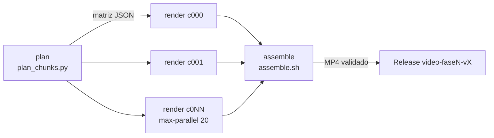
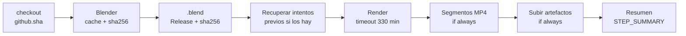

# Estrategia de render distribuido en GitHub Actions

Documento maestro del proyecto AX620. Es la **especificación** que deben seguir
`.github/workflows/benchmark.yml`, `.github/workflows/render.yml`, `scripts/render_chunk.py`,
`scripts/plan_chunks.py`, `scripts/assemble.sh` y `render_config.json`.
Si la implementación y este documento discrepan, se corrige uno de los dos en el mismo commit.

- **Fecha de verificación de los límites de GitHub:** 2026-10-02 (documentación oficial de GitHub Docs).
- **Versión de Blender verificada:** 5.2.2 (tarball Linux x64 publicado el 15-09-2026 en download.blender.org).
- **Convención numérica:** en el texto, separador de miles con punto y decimales con coma (16.200 s; 1,15). En código y JSON, notación inglesa (`16200`, `1.15`).

## Índice

- [a) Recursos y límites](#a-recursos-y-límites)
- [b) Arquitectura](#b-arquitectura)
- [c) Distribución del .blend](#c-distribución-del-blend)
- [d) Instalación y ejecución de Blender en el runner](#d-instalación-y-ejecución-de-blender-en-el-runner)
- [e) Benchmark obligatorio](#e-benchmark-obligatorio)
- [f) Cálculo de trozos](#f-cálculo-de-trozos)
- [g) Ajustes de render comunes](#g-ajustes-de-render-comunes)
- [h) Seguridad ante el corte de 6 h](#h-seguridad-ante-el-corte-de-6-h)
- [i) Reanudación](#i-reanudación)
- [j) Montaje final](#j-montaje-final)
- [k) Fotos fijas](#k-fotos-fijas)
- [l) Vigilancia y fallos](#l-vigilancia-y-fallos)
- [m) Riesgos y normas](#m-riesgos-y-normas)
- [n) Checklist previa al lanzamiento](#n-checklist-previa-al-lanzamiento)
- [Referencia de render_config.json](#referencia-de-render_configjson)
- [Contratos entre componentes](#contratos-entre-componentes)

---

## a) Recursos y límites

Todos los valores se han comprobado en la documentación oficial de GitHub el **2026-10-02**.
⚠️ marca un valor que **ha cambiado** respecto a los datos de partida del proyecto.

| Límite | Valor | Consecuencia práctica | Verificado |
|---|---|---|---|
| Coste de Actions en repositorio público con runners estándar | **Gratis y sin cuota de minutos** ("free for standard GitHub-hosted runners in public repositories") | Podemos consumir cientos de horas de runner sin pagar. La cuota del plan Free (2.000 min/mes, 500 MB de artefactos) solo se aplica a repositorios privados. **El repositorio debe seguir siendo público.** | 2026-10-02 |
| Runner `ubuntu-latest` en repo público | **4 vCPU, 16 GB de RAM, 14 GB de SSD**, x64, Ubuntu 24.04, **sin GPU** | Cycles solo en CPU con 4 hilos. Disco ajustado: hay que presupuestar Blender + `.blend` + PNG + segmento. | 2026-10-02 |
| Runner `ubuntu-latest` en repo privado (referencia) | 2 vCPU, 8 GB de RAM, 14 GB de SSD | Si el repo pasara a privado tendríamos la mitad de CPU **y** consumiríamos minutos de pago. No hacerlo. | 2026-10-02 |
| Tiempo máximo por trabajo (job) | **6 h**; al llegar, el trabajo se termina y falla | Cada trozo se planifica a **4 h 30 min** de render útil y el paso de render se corta a **5 h 30 min** (`timeout-minutes: 330`). | 2026-10-02 |
| Duración máxima de una ejecución de workflow | **35 días** (incluye esperas en cola y aprobaciones) | Un vídeo de muchas oleadas cabe en una sola ejecución. | 2026-10-02 |
| Trabajos por matriz | **256** por ejecución | Si un vídeo necesita más de 256 trozos, se lanza en varias **tandas** (ejecuciones). | 2026-10-02 |
| Concurrencia (plan Free) | **20 trabajos simultáneos** (de ellos, máx. 5 de macOS), a nivel de **cuenta/plan**, no de repositorio | `max-parallel: 20`. El trabajo 21 en adelante espera en cola. Crear más repositorios **no** da más concurrencia. Cualquier otro workflow de la cuenta compite por esos 20 huecos. | 2026-10-02 |
| Re-ejecuciones | Máx. **50** re-ejecuciones por ejecución de workflow | "Re-run failed jobs" tiene tope. Si se agota, se usa el modo `resume` en una ejecución nueva. | 2026-10-02 |
| Retención de artefactos y logs | **90 días** por defecto; en repos públicos configurable entre **1 y 90 días** | Montar y publicar el vídeo antes de 90 días. Los PNG se suben con `retention-days: 7`; manifiestos y segmentos con 90. | 2026-10-02 |
| Almacenamiento de artefactos | Sin coste en repos públicos (la cuota de 500 MB del plan Free es para privados) | Aun así, PNG con retención corta por uso razonable. | 2026-10-02 |
| Caché (`actions/cache`) | **10 GB** por repositorio | Cachear el tarball de Blender (383.295.504 bytes ≈ 366 MiB para 5.2.2) cabe de sobra. | 2026-10-02 |
| Tamaño de archivo en Git | Aviso a partir de **50 MiB**, bloqueo a partir de **100 MiB** (25 MiB vía navegador) | El `.blend` (~70 MB) no entra en Git. | 2026-10-02 |
| Git LFS, plan Free | ⚠️ **10 GiB de almacenamiento y 10 GiB/mes de ancho de banda** (antes ~1 GB + 1 GB/mes). Sin método de pago, al superarlo LFS se desactiva hasta el mes siguiente | **Sigue sin servir:** un vídeo de 59 trozos descarga 59 × 70 MB = 4.130 MB ≈ 3,85 GiB; con 2–3 vídeos al mes (más benchmarks y *resumes*) se agota la cuota y LFS queda bloqueado en todo el repositorio. Las Releases no tienen ese límite. | ⚠️ 2026-10-02 |
| Assets de Release | Cada archivo **< 2 GiB**; hasta **1.000** assets por Release; **sin límite** de tamaño total ni de ancho de banda | Canal de distribución del `.blend` y de los vídeos/fotos finales. | 2026-10-02 |
| Normas de uso de Actions | En runners de GitHub, prohibida "cualquier actividad no relacionada con la producción, prueba, despliegue o publicación del proyecto de software asociado al repositorio" y cualquier carga desproporcionada | Solo se renderiza **este** proyecto, de forma puntual. Ver [m)](#m-riesgos-y-normas). | 2026-10-02 |

Fuentes: GitHub Docs — *Actions limits*, *GitHub-hosted runners reference*, *GitHub Actions billing*,
*Removing workflow artifacts*, *Configuring the retention period…*, *About large files on GitHub*,
*Git LFS billing*, *About releases*, *GitHub Terms for Additional Products and Features*.

---

## b) Arquitectura

**Un repositorio, un workflow de render con matriz.** Nada de repositorios auxiliares ni
cuentas adicionales.



`render.yml` tiene tres trabajos:

| Trabajo | `runs-on` | Qué hace |
|---|---|---|
| `plan` | `ubuntu-latest` | Lee `render_config.json`, calcula la huella de render, decide los trozos (`full`) o los frames que faltan (`resume`) y expone la matriz como salida JSON. |
| `render` | `ubuntu-latest` | `needs: plan`. `strategy.matrix.trozo: ${{ fromJSON(needs.plan.outputs.trozos) }}`, `fail-fast: false`, `max-parallel: 20`. Un trabajo por trozo. |
| `assemble` | `ubuntu-latest` | `needs: render`, `if: ${{ !cancelled() }}`. Comprueba cobertura completa de frames, concatena segmentos, codifica, valida y publica. Si faltan frames, falla con la lista exacta y el comando de `resume`. |

Esqueleto orientativo de la matriz (la implementación final vive en `render.yml`):

```yaml
render:
  needs: plan
  runs-on: ubuntu-latest
  timeout-minutes: 360
  strategy:
    fail-fast: false        # un trozo fallido no cancela los demás
    max-parallel: 20        # = concurrencia del plan Free
    matrix:
      trozo: ${{ fromJSON(needs.plan.outputs.trozos) }}
  steps:
    # ... ver «Contratos entre componentes»
```

Cada elemento de la matriz es un objeto, no un simple número, para que `resume` pueda
mandar rangos no contiguos:

```json
{ "indice": 7, "nombre": "c007", "rangos": [[323, 368]] }
```

Puntos clave:

- **El límite de 6 h es por trabajo, no por cuenta ni por ejecución, y no se agota.** Cada trozo
  arranca con su propio reloj de 6 h. Si un vídeo necesita 300 h de CPU, se divide en
  ~67 trozos de 4,5 h (300 ÷ 4,5 = 66,7 → 67). GitHub ejecuta 20 a la vez y encola el resto:
  67 ÷ 20 = 3,35 → 4 oleadas. No hay que crear más repositorios ni hacer nada a mano.
- **La concurrencia es por cuenta.** `max-parallel: 20` llena todos los huecos del plan Free.
  Mientras se renderiza, cualquier otro workflow de la cuenta (también de otros repositorios,
  incluido `benchmark.yml`) espera en cola. Un vídeo a la vez.
- **El trabajo 21 en adelante espera en cola automáticamente.** Cuando un trozo termina,
  GitHub arranca el siguiente. Hablamos de "oleadas" para estimar, pero en realidad la cola es
  continua.
- **Tandas sucesivas.** Si hay más de 256 trozos (límite de matriz), `plan_chunks.py` los
  numera globalmente y `render.yml` recibe la entrada `tanda` (1, 2, …): la tanda *k* procesa
  los trozos `(k−1)·256` a `k·256 − 1`. Las tandas se lanzan una detrás de otra (la segunda cuando
  la primera haya terminado o casi) y el montaje se hace con `modo=assemble` indicando todas
  las ejecuciones. También se puede usar una tanda nueva para separar un vídeo largo en
  sesiones de trabajo.
- **Entradas de `render.yml` (`workflow_dispatch`):**

  | Entrada | Valores | Uso |
  |---|---|---|
  | `modo` | `full` · `resume` · `assemble` · `fotos` | Tipo de ejecución. |
  | `runs_previos` | IDs separados por comas | `resume` y `assemble`: ejecuciones cuyos manifiestos y segmentos se reutilizan. |
  | `tanda` | entero ≥ 1 (por defecto 1) | Solo si hay más de 256 trozos. |
  | `frames_por_trozo` | entero (opcional) | Sobrescribe `troceo.frames_por_trozo` en esta ejecución (p. ej. −20 % en un `resume`). |
  | `publicar` | `true` · `false` (por defecto `true`) | Si `false`, el MP4 queda solo como artefacto (revisión previa). |

- `concurrency: { group: render-${{ github.ref }}, cancel-in-progress: false }` a nivel de
  workflow: nunca dos ejecuciones de render a la vez sobre la misma rama. No usar `concurrency`
  a nivel de trabajo dentro de la matriz.

---

## c) Distribución del .blend

El `.blend` **nunca** entra en Git ni en LFS (ver tabla de límites). Se distribuye como
**asset de una GitHub Release**, que no tiene límite de ancho de banda y admite archivos de
hasta 2 GiB.

Procedimiento (una vez por versión del `.blend`):

1. En Blender: *File → External Data → Pack Resources* (aunque el proyecto es procedural,
   garantiza que no haya rutas externas) y guardar. Opcional: *Compress* al guardar para
   reducir la descarga.
2. Calcular el hash: `sha256sum Avion_Fase_3_Cabina.blend`.
3. Crear la Release con el `.blend` como asset:
   `gh release create blend-fase3-v1 Avion_Fase_3_Cabina.blend --title "Blend Fase 3 v1" --notes "SHA-256: <hash>"`
4. Copiar URL y hash en `render_config.json` → `blend.url`, `blend.sha256`, `blend.release_tag`.
   URL con el formato:
   `https://github.com/<propietario>/<repo>/releases/download/<tag>/<archivo>`.

En cada runner:

```bash
curl -fL --retry 5 --retry-delay 10 -o "$RUNNER_TEMP/escena.blend" "$BLEND_URL"
echo "$BLEND_SHA256  $RUNNER_TEMP/escena.blend" | sha256sum -c -   # aborta si no coincide
```

Reglas:

- **Inmutabilidad:** un asset publicado no se reemplaza ni se borra mientras haya un vídeo en
  curso que lo use. Cualquier cambio en el `.blend` = Release nueva (`blend-fase3-v2`) +
  hash nuevo + **vídeo nuevo desde cero** (cambia la huella de render).
- El SHA-256 es la garantía de que los 20+ runners renderizan exactamente el mismo archivo.
- El `.blend` publicado es **público**: cualquiera puede descargarlo.

---

## d) Instalación y ejecución de Blender en el runner

**Versión exacta** fijada en `render_config.json` → `blender.version`, `blender.url`,
`blender.sha256` (tarball oficial de Linux x64 de download.blender.org con el SHA-256 de su
archivo `blender-<versión>.sha256`). Para 5.2.2:

- URL: `https://download.blender.org/release/Blender5.2/blender-5.2.2-linux-x64.tar.xz`
- Tamaño: 383.295.504 bytes
- SHA-256: `84098912789dc450e95697c4184fb8a90acbe5111c2ba4aede3fecb57806a168`

Pasos en el runner:

1. `actions/cache` sobre el tarball, con clave `blender-${version}-${sha256}`. En un fallo de
   caché: `curl -fL --retry 5` desde download.blender.org. En ambos casos, `sha256sum -c`.
2. Extraer a `$RUNNER_TEMP/blender` y **borrar el tarball** después (ahorra ~366 MiB de disco).
3. Dependencias del sistema que Blender headless puede necesitar en Ubuntu 24.04 (instalar con
   `sudo apt-get install -y --no-install-recommends` si faltan; confirmar la lista en el primer
   benchmark): `libxi6 libxxf86vm1 libxfixes3 libxrender1 libxkbcommon0 libsm6 libgl1 libegl1`.
4. `ffmpeg` para los segmentos: comprobar con `ffmpeg -version` e instalar con `apt-get` si no
   está presente.
5. Registrar en el log `blender --version`, `nproc`, `free -g`, `df -h` y el modelo de CPU
   (`lscpu`): sirven para explicar diferencias de tiempo entre runners.

Ejecución **headless** (siempre esta forma):

```bash
"$RUNNER_TEMP/blender/blender" -b "$RUNNER_TEMP/escena.blend" \
  --factory-startup -noaudio -t 4 \
  -P scripts/render_chunk.py -- \
  --config render_config.json \
  --trozo c007 --rangos 323-368 \
  --salida "$RUNNER_TEMP/frames" \
  --manifiesto "$RUNNER_TEMP/manifest-c007.json"
```

- `-b` (background) va primero con el `.blend`; `-P` ejecuta el script; todo lo que va después
  de `--` lo lee `render_chunk.py` (`sys.argv[sys.argv.index("--") + 1:]`).
- `--factory-startup` ignora preferencias y add-ons del usuario: reproducibilidad.
- El script **no** usa `-a`/`-f`: recorre los frames él mismo (para poder saltar los
  existentes, validar y actualizar el manifiesto frame a frame).

---

## e) Benchmark obligatorio

Antes de **cada vídeo** (y cada vez que cambie cualquier cosa de la huella de render) se ejecuta
`benchmark.yml` en un runner real con los **ajustes finales**. Nunca se usan tiempos medidos en
otro sitio (el entorno de Claude: 2 núcleos, ~30 s/frame a 800×450 y 8 muestras, no es
representativo).

1. Elegir **3–5 frames representativos**:
   - el **más simple** (p. ej. exterior con cielo y poco fondo);
   - el **más pesado** (p. ej. cabina con cristales, muchas luces, volumétricos, desenfoque de
     movimiento);
   - **uno intermedio**;
   - opcionalmente, 1–2 más donde haya dudas (cambios de plano, primeros planos).
2. Guardarlos en `benchmark.frames` del `render_config.json` y lanzar
   `gh workflow run benchmark.yml -f frames=1,1350,2700` (la entrada sobrescribe la config).
3. `benchmark.yml` usa una matriz con **un frame por trabajo** (así el benchmark nunca roza las
   6 h y termina antes) y un trabajo final `resumen`. Cada trabajo hace exactamente los mismos
   pasos que un trozo de render (misma versión, mismo `.blend`, mismo script).
4. Salida: artefacto `benchmark.json` y resumen en la página del run con, por frame,
   `t_carga_s` (abrir el `.blend` y preparar la escena) y `t_render_s`; y en global:
   - `s_por_frame_max` = máximo de `t_render_s` → **es el que se usa en la fórmula**;
   - `s_por_frame_medio` = media de `t_render_s` → para estimar horas;
   - `frames_por_trozo` propuesto y la tabla trozos/oleadas/horas (lo calcula `plan_chunks.py`).
5. Copiar `s_por_frame_max_benchmark`, `s_por_frame_medio_benchmark`, `fecha_benchmark` y
   `frames_por_trozo` a `render_config.json` y hacer commit. Rellenar la fila correspondiente de
   la [tabla de escenarios](#tabla-de-escenarios).

Notas:

- Al ir un frame por trabajo, cada medición incluye el arranque en frío de Cycles (sin
  aprovechar `persistent_data`). Es una estimación **conservadora**, que es lo que queremos.
- Si un solo frame tarda más de 16.200 ÷ 1,15 = 14.087 s (~3 h 55 min), la fórmula da
  `frames_por_trozo = 0`: **no se puede renderizar así**. Reducir muestras/resolución o
  simplificar la escena y repetir el benchmark.

---

## f) Cálculo de trozos

### Fórmula

```
frames_por_trozo = floor( 16.200 s ÷ (s_por_frame_máx × 1,15) )
trozos           = ceil( frames_totales ÷ frames_por_trozo )
oleadas          = ceil( trozos ÷ 20 )
horas_reales     ≈ oleadas × ~5 h            (cota superior)
horas_runner     ≈ frames_totales × s_por_frame_medio ÷ 3.600
```

- **16.200 s = 4 h 30 min** de render útil por trozo. El resto de las 6 h se reserva para
  descargar e instalar Blender y el `.blend` (~5–10 min), codificar el segmento y subir
  artefactos (~10–20 min) y absorber imprevistos.
- **1,15** = margen del 15 % para la variación entre runners (no todos tienen la misma CPU) y
  entre frames parecidos.
- **~5 h por oleada** = 4 h 30 min de render planificado + ~30 min de preparación,
  codificación y subida. Es una cota superior: si la mayoría de frames está por debajo del
  máximo, cada oleada dura menos.

### Ejemplo resuelto (⚠️ cifras de EJEMPLO, no medidas)

Supuesto: `s_por_frame_máx = 300 s`; vídeo de **90 s a 30 fps**.

| Paso | Cálculo | Resultado |
|---|---|---|
| Tiempo por frame con margen | 300 × 1,15 | 345 s |
| Frames por trozo | floor(16.200 ÷ 345) = floor(46,96) | **46** |
| Render planificado por trozo (peor caso) | 46 × 345 = 15.870 s | 4 h 24 min 30 s (≤ 4 h 30 min ✔) |
| Render nominal por trozo | 46 × 300 = 13.800 s | 3 h 50 min |
| Frames totales | 90 × 30 | **2.700** |
| Trozos | ceil(2.700 ÷ 46) = ceil(58,7) | **59** (58 de 46 frames + 1 de 2.700 − 58 × 46 = 32 frames) |
| Oleadas | ceil(59 ÷ 20) = ceil(2,95) | **3** (20 + 20 + 19) |
| Tiempo real | 3 × ~5 h | **~15 h** (cota superior) |
| Tiempo de runner consumido | 2.700 × 300 s = 810.000 s | 225 h (repartidas en 20 runners: 11,25 h ideales) |

### Tabla de escenarios

Duración de referencia: **90 s**. Las columnas de rendimiento quedan **pendientes de benchmark**;
la columna de píxeles es exacta y sirve solo como orientación (el coste de Cycles no escala
exactamente con los píxeles).

| Escenario | Resolución | fps | Frames | Píxeles vs 1080p | s/frame máx. | frames/trozo | Trozos | Oleadas | Horas reales (cota) |
|---|---|---|---|---|---|---|---|---|---|
| 1080p30 | 1920×1080 | 30 | 2.700 | 1,00× | pendiente de benchmark | pendiente | pendiente | pendiente | pendiente |
| 1440p30 | 2560×1440 | 30 | 2.700 | 1,78× | pendiente de benchmark | pendiente | pendiente | pendiente | pendiente |
| 2160p30 | 3840×2160 | 30 | 2.700 | 4,00× | pendiente de benchmark | pendiente | pendiente | pendiente | pendiente |
| 2160p60 | 3840×2160 | 60 | 5.400 | 4,00× | pendiente de benchmark | pendiente | pendiente | pendiente | pendiente |

Al rellenarla: anotar la fecha del benchmark y el run ID. Si `Trozos > 256`, indicar el número de
tandas (`ceil(trozos ÷ 256)`).

### Presupuesto de disco por trozo (14 GB)

Tamaño **bruto** (sin comprimir) de un PNG RGB de 16 bits = ancho × alto × 3 canales × 2 bytes.
Es una cota superior; el PNG comprimido ocupa menos.

| Resolución | Bruto por frame |
|---|---|
| 1920×1080 | 12.441.600 B ≈ 11,9 MiB |
| 2560×1440 | 22.118.400 B ≈ 21,1 MiB |
| 3840×2160 | 49.766.400 B ≈ 47,5 MiB |

Regla: `frames_por_trozo × bruto_por_frame ≤ 6 GB`, para dejar sitio a Blender extraído, el
`.blend`, el segmento intermedio y el sistema. Ejemplo: 46 frames a 4K → 46 × 49.766.400 B ≈
2,29 GB ✔. Si la regla no se cumple, se reduce `frames_por_trozo` aunque la fórmula de tiempo
permita más.

---

## g) Ajustes de render comunes

`render_chunk.py` **impone** estos ajustes desde `render_config.json` en todos los trozos, sin
fiarse de lo que diga el `.blend`. Todo lo que no aparece aquí (materiales, luces, light paths,
desenfoque de movimiento…) se toma del `.blend`, que es inmutable gracias al SHA-256.

| Ajuste | Valor | Propiedad de Blender (orientativa) | Motivo |
|---|---|---|---|
| Motor | Cycles | `scene.render.engine = 'CYCLES'` | — |
| Dispositivo | CPU | `scene.cycles.device = 'CPU'` | Sin GPU en el runner. |
| Hilos | 4, fijos | `scene.render.threads_mode = 'FIXED'`, `threads = 4` (+ `-t 4`) | 4 vCPU del runner. |
| Muestras | `cycles.muestras` | `scene.cycles.samples` | Igual en todo el vídeo. |
| Muestreo adaptativo | activado, `umbral_adaptativo` (p. ej. 0,01) | `use_adaptive_sampling`, `adaptive_threshold`, `adaptive_min_samples` | Ahorra tiempo en zonas limpias. |
| Denoise | OIDN | `use_denoising = True`, `denoiser = 'OPENIMAGEDENOISE'` | Funciona en CPU. |
| Persistent data | activado | `scene.render.use_persistent_data = True` | Reutiliza BVH y shaders entre frames del mismo trozo. |
| Semilla de ruido | **estática** (`semilla`, sin animated seed) | `scene.cycles.seed`, `use_animated_seed = False` | Evita el parpadeo de ruido entre frames tras el denoise. |
| Gestión de color | `color.*` (p. ej. sRGB / AgX / None / exp. 0 / gamma 1) | `display_settings.display_device`, `view_settings.view_transform`, `.look`, `.exposure`, `.gamma` | Mismo aspecto en todos los trozos. |
| Resolución | `resolucion.*` | `resolution_x`, `resolution_y`, `resolution_percentage` | — |
| fps | `fps` | `scene.render.fps`, `fps_base = 1` | — |
| Cámara | `camara` | `scene.camera = bpy.data.objects[camara]` | Evita renderizar con otra cámara activa. |
| Salida | PNG, RGB, 16 bits, compresión 15 % | `image_settings.file_format = 'PNG'`, `color_mode = 'RGB'`, `color_depth = '16'`, `compression = 15` | Máxima calidad para el montaje; compresión baja = escritura rápida. |

### Huella de render

`render_chunk.py` y `plan_chunks.py` calculan la **huella de render**: SHA-256 del JSON canónico
(claves ordenadas, sin espacios) formado por `blender`, `blend`, `escena`, `camara`, `frames`,
`resolucion`, `fps`, `cycles`, `color` y `salida`. Se escribe en cada manifiesto.

- `plan` (en `resume`/`assemble`) y `assemble` **rechazan** manifiestos con una huella distinta
  de la actual. Así es imposible mezclar frames de ajustes o versiones distintas.
- `troceo`, `benchmark`, `video` y `fotos` **no** forman parte de la huella (no alteran los
  píxeles de los frames).

---

## h) Seguridad ante el corte de 6 h

Tres capas, de la más suave a la más dura:

1. **Parada suave en el script** (`troceo.parada_suave_s` = 18.000 s = 5 h): antes de empezar
   cada frame, `render_chunk.py` comprueba
   `transcurrido + s_por_frame_max × 1,15 > 18.000 s`; si se cumple, no empieza el frame, cierra
   el manifiesto con `estado: "parcial"` y termina limpio.
2. **Timeout del paso de render:** `timeout-minutes: 330` (5 h 30 min = 19.800 s). Si un frame
   se alarga más de lo previsto, GitHub mata el paso y el trabajo continúa con los pasos
   `if: always()`.
3. **Límite de 6 h del trabajo** (`timeout-minutes: 360`): no debería alcanzarse nunca. Tras el
   minuto 330 + ~5–10 min de preparación quedan ≥ 20 min para codificar y subir.

Pasos del trabajo de render tras el render, **todos con `if: always()`**:

- **Codificar segmento(s)** con los frames válidos que haya (ver [j)](#j-montaje-final)).
- **Subir artefactos** (`actions/upload-artifact`, `if: always()`), para que los frames hechos
  se suban aunque el render se haya cortado:

  | Artefacto | Contenido | Retención | Notas |
  |---|---|---|---|
  | `frames-c007-a1` | PNG del trozo | `retention-days: 7` | `compression-level: 0` (el PNG ya está comprimido). Solo para reanudar intentos y para re-codificar. |
  | `manifest-c007-a1` | `manifest-c007.json` | 90 días (por defecto) | Fuente de verdad de qué frames están hechos. |
  | `segmento-c007-a1` | `seg_000323-000368.mp4` (uno o varios) | 90 días | Entrada del montaje. |

  (`a1` = `github.run_attempt`; así un *Re-run failed jobs* no choca con nombres ya usados.)

### Manifiesto (`manifest-cNNN.json`)

Se reescribe de forma **atómica** (archivo temporal + `rename`) tras cada frame:

```json
{
  "version_manifiesto": 1,
  "trozo": "c007",
  "run_id": 123456789,
  "intento": 1,
  "commit": "<github.sha>",
  "huella_render": "<sha256>",
  "blender": "5.2.2",
  "blend_sha256": "<sha256>",
  "rangos_planificados": [[323, 368]],
  "frames_completados": [
    { "frame": 323, "t_render_s": 291.4, "bytes": 8123456, "sha256": "<sha256 del PNG>" }
  ],
  "frames_fallidos": [],
  "t_carga_s": 41.2,
  "estado": "completo | parcial | fallido",
  "inicio": "2026-10-02T10:00:00Z",
  "fin": "2026-10-02T14:12:00Z"
}
```

Un frame solo entra en `frames_completados` si el PNG se escribió a un archivo temporal, se
renombró, se puede leer, tiene la resolución esperada y no es negro (ver
[l)](#l-vigilancia-y-fallos)).

---

## i) Reanudación

### Dentro de la misma ejecución: *Re-run failed jobs*

Al re-ejecutar un trozo fallido, el trabajo:

1. Descarga los artefactos `frames-cNNN-a*` y `manifest-cNNN-a*` de intentos anteriores de
   **esta** ejecución (si existen y siguen retenidos).
2. Lanza `render_chunk.py`, que **salta los frames que ya existen y validan** (comprobando su
   SHA-256 contra el manifiesto).
3. Codifica el segmento del trozo completo y sube artefactos con el nuevo sufijo `a2`, `a3`…

Límite: 50 re-ejecuciones por ejecución. Si un trozo falla dos veces por tiempo, no insistir:
pasar a `resume` con `frames_por_trozo` reducido.

### Ejecución nueva: modo `resume`

```bash
gh workflow run render.yml -f modo=resume -f runs_previos=123456789
# con trozos más pequeños tras un corte por tiempo (46 → 36, −20 % redondeando hacia abajo):
gh workflow run render.yml -f modo=resume -f runs_previos=123456789 -f frames_por_trozo=36
```

El trabajo `plan` (con `permissions: actions: read` y el `GITHUB_TOKEN`):

1. Descarga **todos** los manifiestos `manifest-*` de las ejecuciones de `runs_previos`
   (`actions/download-artifact` con `run-id` y `github-token`).
2. Descarta (y avisa) los que tengan una huella de render distinta de la actual.
3. Calcula `faltan = [frames.inicio … frames.fin] − ⋃ frames_completados`.
4. Reparte **solo** esos frames en trozos de `frames_por_trozo` (pueden ser rangos no
   contiguos dentro de un trozo) y emite la matriz. Si `faltan` está vacío, salta directamente
   al montaje.

Los trabajos `render` de un `resume` funcionan igual que en `full`; además, el script salta
cualquier frame que ya exista en su carpeta de salida. Para encadenar varios `resume`, se
pasan **todas** las ejecuciones anteriores: `-f runs_previos=111,222,333`.

---

## j) Montaje final

### Segmentos intermedios (en cada trozo)

Cada trozo codifica, por cada **tramo contiguo** de frames válidos, un MP4 intermedio H.264 de
muy alta calidad. Así el trabajo de montaje no tiene que descargar todos los PNG (no cabrían en
los 14 GB del runner a 4K).

```bash
ffmpeg -framerate "$FPS" -start_number 323 -i "$FRAMES/frame_%06d.png" -frames:v 46 \
  -c:v libx264 -preset medium -crf 11 -pix_fmt yuv444p10le -profile:v high444 \
  -g "$FPS" -an "seg_000323-000368.mp4"
```

- CRF intermedio **10–12** (`video.crf_intermedio`, por defecto 11).
- `yuv444p10le` (perfil High 4:4:4) evita submuestrear el croma dos veces y reduce el *banding*
  en degradados; si el `ffmpeg` del runner no lo soporta, `yuv444p`.
- Nombre `seg_<inicio>-<fin>.mp4` con 6 dígitos: el orden alfabético es el orden temporal.

### Trabajo `assemble` (`needs: render`)

1. Descarga todos los `manifest-*` y `segmento-*` de la ejecución actual y de `runs_previos`.
2. **Cobertura:** comprueba que cada frame de `[inicio, fin]` está en exactamente un segmento
   elegido. Si hay solapes, gana el segmento de la ejecución más reciente y, dentro de ella, el
   del intento más alto; los segmentos contenidos en otro elegido se descartan. Un solape
   parcial no resoluble o un hueco = **error** con la lista de frames y el comando de `resume`.
3. **Disco:** antes de empezar, `suma(segmentos) × 2 < espacio libre` (`df`); si no, error claro.
4. **Concatenación en orden** y **una única codificación final**:

   ```bash
   # lista.txt:  file 'seg_000001-000046.mp4'  (una línea por segmento, en orden)
   ffmpeg -f concat -safe 0 -i lista.txt \
     -c:v libx264 -profile:v high -preset slow -crf 18 -pix_fmt yuv420p \
     -r "$FPS" -movflags +faststart -an "Video_Fase_3.mp4"
   ```

   CRF final **≤ 18** (`video.crf_final`). Sin audio (si algún día se añade, se mezcla en este
   paso).
5. **Validación con `ffprobe`:**

   ```bash
   ffprobe -v error -select_streams v:0 -count_frames \
     -show_entries stream=width,height,r_frame_rate,nb_read_frames,pix_fmt,profile \
     -show_entries format=duration -of json "Video_Fase_3.mp4"
   ```

   | Comprobación | Esperado (ejemplo 90 s a 30 fps) |
   |---|---|
   | `width` × `height` | `resolucion.ancho` × `resolucion.alto` (1920×1080) |
   | `r_frame_rate` | `fps/1` (`30/1`) |
   | `nb_read_frames` | `fin − inicio + 1` (2.700) |
   | `duration` | `frames ÷ fps` ± 1 frame (90,000 s ± 0,033 s) |
   | `pix_fmt` / `profile` | `yuv420p` / `High` |
   | Tamaño del archivo | < 2 GiB (límite de asset de Release) |

6. **Publicación:** con `permissions: contents: write`, crea la Release `video.release_tag`
   (`gh release create video-fase3-v1 Video_Fase_3.mp4 manifiesto_final.json …`).
   `manifiesto_final.json` resume huella, commit, runs usados y frames. Si `publicar=false`, el
   MP4 queda como artefacto `video-final` para revisión.

---

## k) Fotos fijas

Mismo sistema, misma huella de versión, mismo script, con `render.yml` en `modo=fotos`:

- La lista `fotos` del `render_config.json` define cada foto (`id`, `camara`, `frame`,
  `ancho`, `alto`, `muestras`). Por defecto **4K (3840×2160)** y **más muestras** que el vídeo.
  El resto de ajustes de [g)](#g-ajustes-de-render-comunes) se aplican igual.
- **Un trabajo por foto** (matriz sobre `fotos`). Si las fotos son rápidas, se agrupan en
  **lotes** con la misma fórmula: `fotos_por_trabajo = floor(16.200 ÷ (s_por_foto_máx × 1,15))`.
- Benchmark: `benchmark.yml` con la entrada `tipo=fotos` renderiza las fotos más pesadas.
  Si una sola foto supera 14.087 s (≈ 3 h 55 min), reducir muestras. (Partir una foto en
  regiones con *border render* y coserlas queda como opción futura, no implementada.)
- Salida: PNG RGB 16 bits, `<id>.png`, publicados como assets de la Release `fotos_release_tag`.

---

## l) Vigilancia y fallos

### Vigilancia

- `gh run list --workflow render.yml` y `gh run watch <run_id>`; o la pestaña **Actions**.
- Cada trabajo escribe en `$GITHUB_STEP_SUMMARY`: frames planificados/hechos, s/frame real
  (máx./media) frente al benchmark, CPU del runner y espacio libre.
- **Alerta temprana:** si un trozo mide un `s/frame` real > 1,15 × `s_por_frame_max_benchmark`,
  lo escribe como `::warning::`. Si ocurre en varios trozos de la primera oleada, conviene
  cancelar, reducir `frames_por_trozo` y reanudar en vez de esperar cortes.

### Detección de frames malos (dentro de `render_chunk.py`)

- Escritura atómica: Blender escribe en `frame_000123.tmp.png` → validación → `rename`.
- Validación: el archivo existe, tamaño > 0, cabecera PNG correcta, se carga, resolución
  esperada.
- **Frame negro:** luminancia media < 0,002 (en 0–1) → se marca en `frames_fallidos` y se
  reintenta una vez. Si se repite, queda como fallido y el montaje no arranca hasta revisarlo.

### Tabla de fallos típicos

| Síntoma | Causa probable | Acción |
|---|---|---|
| Trabajo cancelado a las 6 h | Trozo demasiado grande | Lanzar el modo `resume` y reducir `frames_por_trozo` un 20 % |
| Paso de render cortado a los 330 min (manifiesto `parcial`) | s/frame real mayor que el benchmark (frame pesado no incluido, runner más lento) | `resume` con `frames_por_trozo` −20 %; añadir ese frame al próximo benchmark |
| Muchos trozos `parcial` por parada suave | `s_por_frame_max` infravalorado | Cancelar, repetir benchmark con frames más pesados, `resume` con el nuevo valor |
| `No space left on device` | PNG acumulados (4K), tarball sin borrar, segmentos grandes | Comprobar regla de disco de [f)](#presupuesto-de-disco-por-trozo-14-gb); borrar tarball tras extraer; reducir `frames_por_trozo` |
| `sha256sum: WARNING: computed checksum did NOT match` (`.blend`) | Asset reemplazado, URL de otra Release, descarga truncada | Corregir URL/hash. Nunca reemplazar un asset: Release nueva y vídeo nuevo |
| `curl: (22) … 404` o timeout al descargar | Release borrada, tag mal escrito, blender.org caído | Revisar `blend.url`; los `--retry 5` cubren cortes breves; re-ejecutar el trabajo |
| Blender termina con `Segmentation fault` o el runner muere | Falta de RAM (16 GB), escena muy pesada | Revisar `free -g` en el log; si es OOM, cambiar ajustes = **vídeo nuevo** (cambia la huella) |
| Blender no arranca: `error while loading shared libraries` | Falta una librería del sistema | Añadir el paquete a la lista de `apt-get` de [d)](#d-instalación-y-ejecución-de-blender-en-el-runner) |
| Frame negro | Cámara o escena equivocada, luces en otra view layer, colección oculta en render | Revisar `escena`/`camara` en la config; probar ese frame en el benchmark |
| PNG corrupto o truncado | Corte durante la escritura | La escritura atómica lo descarta; se re-renderiza en el reintento o `resume` |
| Parpadeo de ruido entre frames | Semilla animada o ajustes distintos entre trozos | Comprobar `semilla_animada: false` y que todos los manifiestos tienen la misma huella |
| Saltos de color o brillo entre segmentos | Gestión de color distinta | Imposible con huella única; si aparece, revisar que el script impone `color.*` |
| Montaje: "faltan frames" | Trozos incompletos o fallidos | `modo=resume` con todos los `runs_previos` |
| `ffprobe`: `nb_read_frames` no cuadra | Segmento duplicado o solapado en `lista.txt` | Revisar la selección de segmentos del montaje |
| Trabajos en cola mucho tiempo | Otros workflows de la cuenta ocupan los 20 huecos | Esperar o cancelar los otros; un vídeo a la vez |
| "Re-run" no disponible | Agotadas las 50 re-ejecuciones | `modo=resume` en una ejecución nueva |
| Artefactos `frames-*` desaparecidos | Retención de 7 días vencida | No afecta a `resume`/`assemble` (usan manifiestos y segmentos, 90 días) |

---

## m) Riesgos y normas

### Visibilidad pública

- El código, la configuración, los logs, los artefactos (frames, segmentos) y las Releases
  (`.blend`, vídeos, fotos) son **públicos**. Cualquiera puede descargar el `.blend`.
- Antes de publicar, revisar que el `.blend` no contiene nada que no deba verse (textos
  internos, rutas locales con nombre de usuario, objetos ocultos).
- Elegir una licencia (`LICENSE`) que refleje lo que se permite hacer con el modelo y los vídeos.
- Ningún dato personal, token ni secreto en el repositorio. El `GITHUB_TOKEN` es automático y
  se usa con permisos mínimos.

### Uso razonable de Actions

Las condiciones de GitHub prohíben usar los runners para actividades **no relacionadas** con el
proyecto del repositorio y cualquier uso que suponga una carga desproporcionada. Renderizar los
vídeos de **este** proyecto de forma puntual es una zona gris aceptable si no se abusa:

- Un vídeo a la vez; nada de render continuo ni de trabajos para terceros.
- Benchmark primero: no lanzar cientos de horas a ciegas.
- Cancelar ejecuciones que se sepa que no sirven (ajustes erróneos, `.blend` equivocado).
- PNG con retención de 7 días; borrar artefactos y Releases obsoletos.
- No crear repositorios ni cuentas adicionales para esquivar límites (además de inútil para la
  concurrencia, viola las condiciones).

### Si GitHub limita la cuenta

Las sanciones posibles van desde cancelar trabajos o restringir Actions hasta deshabilitar el
repositorio o suspender la cuenta.

1. Parar: cancelar todas las ejecuciones en curso y no lanzar nada nuevo.
2. Leer el aviso de GitHub y responder por el canal de soporte que indique, explicando el uso
   (render puntual de los vídeos del propio proyecto).
3. **No** intentar esquivarlo con otros repositorios o cuentas.
4. Plan B: renderizar con el mismo `render_chunk.py` y `render_config.json` en otra máquina
   (local o nube de pago). Los manifiestos y segmentos ya hechos siguen siendo válidos si la
   huella coincide.

---

## n) Checklist previa al lanzamiento

- [ ] El repositorio es **público** y no contiene `.blend`, secretos ni datos personales.
- [ ] El `.blend` tiene los recursos empaquetados y está publicado en una Release `blend-<fase>-v<n>`.
- [ ] `blend.url` descarga el archivo y `sha256sum` coincide con `blend.sha256`.
- [ ] `blender.version`, `blender.url` y `blender.sha256` corresponden al tarball oficial y a la versión con la que se hizo el `.blend` (misma serie, p. ej. 5.2.x).
- [ ] `escena` y `camara` existen en el `.blend` con esos nombres exactos.
- [ ] `frames.inicio`/`frames.fin` y `fps` dan la duración deseada (frames = duración × fps).
- [ ] Resolución, muestras, umbral adaptativo, denoise, semilla estática y gestión de color son los **definitivos**.
- [ ] Benchmark ejecutado con esos ajustes en un runner real, con el frame más simple, el más pesado y uno intermedio; `s_por_frame_max_benchmark` y `fecha_benchmark` anotados.
- [ ] `frames_por_trozo` calculado con la fórmula y comprobado a mano; cumple la regla de disco.
- [ ] Trozos ≤ 256 (si no, tandas planificadas) y horas estimadas aceptables.
- [ ] `video.nombre_salida` en ASCII sin espacios y `video.release_tag` sin usar.
- [ ] No hay otros workflows de la cuenta ocupando la concurrencia.
- [ ] `render_config.json` final está en un commit de la rama desde la que se lanza.
- [ ] Se ha leído esta checklist con alguien (o con Claude) antes de lanzar el `full`.

---

## Referencia de render_config.json

Se crea copiando `render_config.example.json`. Las claves que empiezan por `_` son comentarios
y se ignoran. **H** = forma parte de la huella de render (no se cambia a mitad de un vídeo).

| Campo | Tipo | H | Descripción |
|---|---|---|---|
| `version_config` | entero | — | Versión del esquema (1). |
| `blender.version` | texto | H | Versión exacta, p. ej. `5.2.2`. |
| `blender.url` | URL | H | Tarball oficial Linux x64. |
| `blender.sha256` | hex 64 | H | Hash oficial del tarball. |
| `blend.release_tag` | texto | H | Tag de la Release que contiene el `.blend`. |
| `blend.url` | URL | H | URL de descarga del asset. |
| `blend.sha256` | hex 64 | H | Hash del `.blend`. |
| `escena` | texto | H | Nombre de la escena. |
| `camara` | texto | H | Nombre del objeto cámara. |
| `frames.inicio`, `frames.fin` | enteros | H | Rango inclusivo. |
| `resolucion.ancho`, `.alto`, `.porcentaje` | enteros | H | Resolución de salida. |
| `fps` | entero | H | Fotogramas por segundo. |
| `cycles.dispositivo` | `CPU` | H | Siempre CPU. |
| `cycles.hilos` | entero | H | 4. |
| `cycles.muestras` | entero | H | Muestras máximas por píxel. |
| `cycles.muestreo_adaptativo` | bool | H | `true`. |
| `cycles.umbral_adaptativo` | número | H | Umbral de ruido, p. ej. `0.01`. |
| `cycles.muestras_min` | entero | H | 0 = automático. |
| `cycles.denoise`, `cycles.denoiser` | bool, texto | H | `true`, `OPENIMAGEDENOISE`. |
| `cycles.persistent_data` | bool | H | `true`. |
| `cycles.semilla` | entero | H | Semilla estática. |
| `cycles.semilla_animada` | bool | H | Siempre `false`. |
| `color.dispositivo_display`, `.view_transform`, `.look`, `.exposicion`, `.gamma` | varios | H | Gestión de color. |
| `salida.formato`, `.modo_color`, `.profundidad_bits`, `.compresion_png`, `.patron` | varios | H | PNG, RGB, 16, 15, `frame_{:06d}.png`. |
| `troceo.presupuesto_render_s` | entero | — | 16200 (4 h 30 min). |
| `troceo.factor_seguridad` | número | — | 1.15. |
| `troceo.s_por_frame_max_benchmark` | número | — | Resultado del benchmark. |
| `troceo.s_por_frame_medio_benchmark` | número | — | Resultado del benchmark. |
| `troceo.fecha_benchmark` | fecha ISO | — | Cuándo se midió. |
| `troceo.frames_por_trozo` | entero | — | Resultado de la fórmula; puede cambiar entre ejecuciones. |
| `troceo.max_paralelo` | entero | — | 20. |
| `troceo.parada_suave_s` | entero | — | 18000 (5 h). |
| `benchmark.frames` | lista | — | 3–5 frames representativos. |
| `video.nombre_salida` | texto | — | MP4 final, ASCII sin espacios. |
| `video.titulo` | texto | — | Título visible en la Release. |
| `video.release_tag` | texto | — | Release donde se publica. |
| `video.crf_intermedio` | entero | — | 10–12. |
| `video.pix_fmt_intermedio` | texto | — | `yuv444p10le`. |
| `video.crf_final` | entero | — | ≤ 18. |
| `video.preset_final`, `.pix_fmt_final`, `.perfil_final` | texto | — | `slow`, `yuv420p`, `high`. |
| `fotos[]` | lista | — | `id`, `camara`, `frame`, `ancho`, `alto`, `muestras`. |
| `fotos_release_tag` | texto | — | Release de las fotos. |

---

## Contratos entre componentes

Para que la implementación encaje sin ambigüedades:

| Componente | Entrada | Salida |
|---|---|---|
| `scripts/plan_chunks.py` | `--config render_config.json`; opcional `--benchmark benchmark.json`, `--manifiestos <dir>`, `--frames-por-trozo N`, `--tanda K` | JSON por stdout: `{"frames_por_trozo": N, "trozos": [{"indice", "nombre", "rangos"}], "total_trozos", "oleadas", "horas_estimadas"}`; código ≠ 0 si la fórmula da 0 o la huella no coincide. |
| `scripts/render_chunk.py` | Ejecutado por Blender; tras `--`: `--config`, `--trozo`, `--rangos 1-46[,60-70]`, `--salida <dir>`, `--manifiesto <ruta>`; opcional `--benchmark`, `--foto <id>` | PNG validados en `<dir>`, manifiesto actualizado frame a frame. Código 0 si `completo` o `parcial` por parada suave; ≠ 0 si hay frames fallidos. |
| `scripts/assemble.sh` | `--config render_config.json --segmentos <dir> --manifiestos <dir> --salida <mp4>` | MP4 final + `manifiesto_final.json`; código ≠ 0 si falta cobertura o falla `ffprobe`. |
| `.github/workflows/benchmark.yml` | `workflow_dispatch`: `frames`, `tipo` (`video`/`fotos`) | Artefacto `benchmark.json` + resumen. |
| `.github/workflows/render.yml` | `workflow_dispatch`: `modo`, `runs_previos`, `tanda`, `frames_por_trozo`, `publicar` | Artefactos por trozo, `video-final` y Release. |

Orden de pasos de cada trabajo de `render`:


